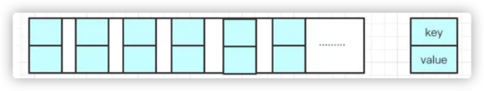

> 1.了解HashMap吗？能说一下它的结构和底层原理吗？

HashMap是常用的数据结构，由**数组和链表组合构成**的数据结构。  
每个数组里都存了Key-Value这样的实例，在Java7中叫Entry在Java8中叫Node。


在进行put操作插入的时候，哈希函数会根据key值计算出哈希值，计算出index的值。在index位置插入该组数。


> 2.你提到了列表，为啥需要链表，链表是什么样子的？

数组的长度是有限的，在使用哈希值计算索引的时候，有一定的概率会发生hash冲突。即两个不同的key计算出相同的index。这时候就要使用链表~

每个节点都会保存自身的**哈希值、key、value、以及下一个节点node**

> 3.链表再插入的时候，是怎么插入的呢？

java8之前都是头插法，也就是说后来的值会取代原有的值，原来的值就推到了链表上去了。因为写这个代码的作者认为后来的值被查找的可能性会大一点，这样可以提升查找的效率。

但是**在java8之后，都是用尾插法**了。

> 4.为什么要改为尾部插入呢？

这个涉及到HashMap的扩容机制，数组的容量是有限的，数据多次插入的时候，到达一定的数量就会进行扩容，也就是resize。

> 5.什么时候会resize呢？

有两个因素：

- Capacity: HashMap当前的长度
- LoadFactor: 负载因子，默认值为0.75

数组容量 = Capacity*LoadFactor  
举个栗子：数组容量为100,负载因子为0.75.那么**数组中**存入第76个时，就会触发扩容。

> 6.为什么要有负载因子，负载因子为什么是0.75？

为什么是0.75，为了兼顾时间和空间，加载因子过大的时候，会有更多的哈希冲突，数据不够散列,增加查询的开销（put和get都会用到查询）。加载因子过小，浪费空间。根据牛顿二项式定理得知，在数组长度为无穷的时候，0.63为最优值。

> 7.扩容？它是怎么扩容的？

分为两步：
- 扩容：创建一个新的Entry空数组，长度为原数组的两倍
- ReHash: 遍历原Entry数组，把所有的Entry重新Hash到新数组

> 8.为什么要重新Hash，直接复制过去不香么？

这个涉及到了索引值的计算规则。  
index = HashCode(key) & (Length - 1)  
原来的长度变了，索引值也就随之改变了。

>  4.言归正传，为什么要改为尾部插入呢？

单线程使用HashMap是安全的，但一旦涉及到多线程扩容的时候。可能会形成链环，内存被100%占用。尾部插入法在扩容的时候会保持链表元素原本的顺序，就不会出现链表成环的问题。

> 9.那是不是意味着Java8就可以在HashMap中使用多线程呢？

不是的，因为在Put/Get的源码中都没有加同步锁，因此多线程情况下，无法保证上一秒Put的值，下一秒Get到原值，线程安全无法保证。比如当两个线程同时put时，恰巧两个hash值一样的，并且该index数据为Null。源码中显示如果为Null，直接插入。A进入后还没插入被挂起，B正常执行插入数据。然后A获取CPU的时间片，但是A不会再进行hash判断，问题出现：线程A会把线程B插入的数据给覆盖掉，发生线程不安全。


```
小结：

1.在jdk1.7中，在多线程环境下，扩容时会造成环形链或数据丢失。
2.在jdk1.8中，在多线程环境下，会发生数据覆盖的情况。

```


> 10.jdk1.8在hashMap上还有什么优化吗？

HashMap在JDK1.8的版本中引入了红黑树结构做优化，当链表元素个数大于等于8时，链表转换成树结构；若桶中链表元素个数小于等于6时，树结构还原成链表。因为红黑树的平均查找长度是log(n)，长度为8的时候，平均查找长度为3，如果继续使用链表，平均查找长度为8/2=4，这才有转换为树的必要。链表长度如果是小于等于6，6/2=3，虽然速度也很快的，但是转化为树结构和生成树的时间并不会太短。还有选择6和8，中间有个差值7可以有效防止链表和树频繁转换。假设一下，如果设计成链表个数超过8则链表转换成树结构，链表个数小于8则树结构转换成链表，如果一个HashMap不停的插入、删除元素，链表个数在8左右徘徊，就会频繁的发生树转链表、链表转树，效率会很低。

> 11.HashMap的初始化大小是多少？为什么？

初始化大小是16，取得都是2的幂次方。原因**是位运算比算数运算效率高的多**；

再看下index的计算公式：index = HashCode(Key) & (Length - 1)

2的n次方 - 1 的二进制全都是1。这是取模的的结果就等于是HashCode的最后几位值，只要HashCode本身分布均匀，Hash算法的结果就是均匀的。为了**实现均匀分布**。


> 12.怎么处理HashMap的线程安全问题

有人曾因为HashMap扩容时会有概率发生链环的bug，sun公司不承认这个BUG, 因为他们官方是建议在单线程下使用HashMap，多线程下使用CurrentHashMap或者HahTable

HashTable直接在方法上上锁，并发度很低;初始size是11，扩容：newSize = oldSize * 2 + 1。CurrentHashMap并发度高，并且1.7和1.8也有很大的不同。

> 13.咱们聊聊CurrentHashMap
