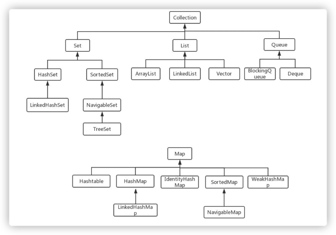

# 集合容器概述
## 集合和数组的区别
- 数组长度固定；集合可变长度
- 数组可以存储基本数据类型，也可以存储引用数据类型；集合只能存储引用数据类型
- 数组存储的元素必须是同一个数据类型；集合存储的对象可以是不同数据类型

## 常用的集合类有哪些
Map接口和Collection接口是所有集合框架的父接口：
1. Map接口的实现类主要有：HashMap、TreeMap、HashTable、ConcurrentHashMap和Properties等
2. Collection接口的子接口有：Set接口和List接口
3. Set接口的实现类主要由：HashSet、TreeSet、LinkedHashSet等
4. List接口的实现类主要有：ArrayList、LinkedList、Stack和Vector等
   


## List，Set，Map三者的区别？List、Set、Map 是否继承自 Collection 接口？List、Map、Set 三个接口存取元素时，各有什么特点？
Java容器分为Collection和Map两大类。Collection集合的子接口有Set、List、Queue三种子接口。我们常用的是List和Set，Map不是Collection的子接口。

Collection集合主要有List和Set两大接口
- List：有序容器（元素存入和取出顺序一致），元素可重复。可以插入多个null元素，每个元素有索引。常见的实现类有ArrayList、LinkedList和Vector
- Set：无序容器（存入和取出有可能不一致），不可以存储重复元素，只允许存储一个null元素，必须保证元素的唯一性。常见的实现类是HashSet、LinkedHashSet以及TreeSet

Map是一个键值对集合，存储键、值之间的映射。Key无序，唯一；value1buyaoqiu有序，允许重复值。常见的实现类有HashMap、TreeMap、HashTable、LinkedHashMap、ConcurrentHashMap。


## 集合底层数据结构
- ArrayList：数组
- Vector： 数组
- LinkedList：双向循环链表
- HashSet：HashMap
- LinkedHashSet：继承与HashSet
- TreeSet：红黑树
- HashMap：JDK1.8之前由数组+链表，JDK1.8后数组+链表+红黑树
- LinkedHashMap：继承于HashMap
- HashTable：数组+链表
- TreeMap：红黑树

## 哪些集合类是线程安全的
- Vector：比ArrayList多一个同步化机制，效率低下。已经很少使用
- Stack：堆类栈，先进后出
- HashTable：比HashMap多了线程安全
- Enumeration：枚举，相当于迭代器


# Collection接口
## List接口
### 迭代器Iterator是什么？
Iterator接口提供遍历任何Collection的接口，并允许调用者在迭代过程中移除元素。

```java
List<String> list = new ArrayList<>();
Iterator<String> it = list. iterator();
while(it. hasNext()){
  String obj = it. next();
  System. out. println(obj);
}
```

### Iterator和ListIterator有什么区别？
- Iterator可以遍历Set和List集合，ListIterator只能遍历List
- Iterator只能单向遍历，而ListIterator可以双向遍历
- ListIterator实现Iterator接口，添加了额外的功能，比如添加、替换元素、获取前面或者后面元素的索引位置


### 说一下ArrayList的优缺点
ArrayList的优点：
- 底层是数组实现，是一种随机访问模式。实现了RandomAccess接口，所以查找非常快
- 在顺序添加一个元素的时候非常方便

ArrayList的缺点：
- 删除元素的时候，需要做一次元素的复制操作。如果数据比较多，比较耗费性能
- 插入元素的时候，也需要做元素的复制操作

因此ArrayList适合顺序添加、随机访问的场景。

### 如何实现数组和List直接的转化？
- 数组转List：使用Arrays.asList(Array)进行转化
- List转数组：使用List自带的toArray()方法

### ArrayList和LinkedList区别是什么？
- 数据结构实现：ArrayList是动态数组的数据结构实现，而LinkedList是双向链表的数据结构实现。
- 随机访问效率：ArrayList比LinkedList在随机访问的时候效率要高，因为LinkedList是线性的数据存储方式，需要移动指针从前往后依次查找。
- 增加和删除效率：在非首尾的增加和删除操作，LinkedList要比ArrayList效率高，因为ArrayList增删需要复制数组，并且移动其它数据的下标。
- 内存空间占用：LinkedList比ArrayList更占内存，因为LinkedList除了存储数据，还存储了两个引用，一个指向前一个元素，一个指向后一个元素。
- 线程安全：两者都不是同步的，都不保证线程安全。

综合来说，需要频繁读取数据的时候，使用ArrayList，而在插入和删除操作比较多的时候，更推荐使用LinkedList。

### ArrayList和Vector的区别是什么
两个类都实现了List接口（List继承Collection接口），他们都是有序集合。
- 线程安全：Vector是线程安全的，ArrayList是非线程安全的
- 性能：ArrayList性能方便由于Vector
- 扩容：两者都会动态扩容，Vector一倍扩容，ArrayList增加50%

实际中根据是否要保证线程安全来决定使用Vector还是ArrayList。

## Set接口
### HashSet的实现原理
HashSet是基于HashMap实现的，HashSet的值存放于HashMap的key上，HashSet的value统一为PRESENT，因此HashSet的实现比较简单。相关HashSet的操作，基本上都是直接调用底层HashMap的相关方法来完成，HashSet不允许重复值。

**HashSet如何检查重复**  
先计算对象的HashCode值，和已加入对象的哈希值比较，如果不等就插入。如果相等，调用equals方法检查两个对象是否真的相同。如果相同，HashSet就不会让加入操作成功。

## Queue
### BlockingQueue是什么？
Java.util.concurrent.BlockingQueue是一个队列，在进行检索或移除一个元素的时候，它会等待队列变为非空；当在添加一个元素时，它会等待队列中的可用空间。BlockingQueue接口是Java集合框架的一部分，主要用于实现生产者-消费者模式。我们不需要担心等待生产者有可用的空间，或消费者有可用的对象，因为它都在BlockingQueue的实现类中被处理了。Java提供了集中BlockingQueue的实现，比如ArrayBlockingQueue、LinkedBlockingQueue、PriorityBlockingQueue,、SynchronousQueue等。

### 在 Queue 中 poll()和 remove()有什么区别？
- 相同点：都是返回第一个元素，并在队列中删除返回的对象。
- 不同点：如果没有元素 poll()会返回 null，而 remove()会直接抛出 NoSuchElementException 异常。

# Map接口
Map接口主要实现类有HashMap、HashTable、ConcurrentHashMap。==**这里是面试的高频点**==
1. HashMap的实现原理，在jdk1.7和1.8的区别
2. ConcurrentHashMap的实现原理，在jdk1.7和1.8的区别
3. HashTable的实现原理，和HashMap和ConcurrentHashMap三者之间的比较。
4. 扩容操作、哈希冲突问题、红黑树等等

这里单独写了两篇博客，有兴趣的可以看一下：  
HashMap相关面试题
ConcurrentHashMap相关面试题


# 辅助工具类
## comparable和comparator的区别？
- comparable接口出自java.lang包，它有一个compareTo（Object obj）方法用来排序
- comparator接口出自java.util包，它有一个compare(Object obj1, Object obj2)方法来排序

## Collection和Collections有什么区别？
- java.util.Collection是一个集合接口。它提供了对集合对象进行基本操作的通用接口方法。Collection接口在Java类库中有很多具体的实现，Collection接口的意义是为各种具体的集合提供了最大化的统一操作方式。
- Collections是集合类的一个工具类/帮助类，其中提供了一系列静态方法，用于对集合中元素进行排序、搜索以及线程安全等各种操作。


