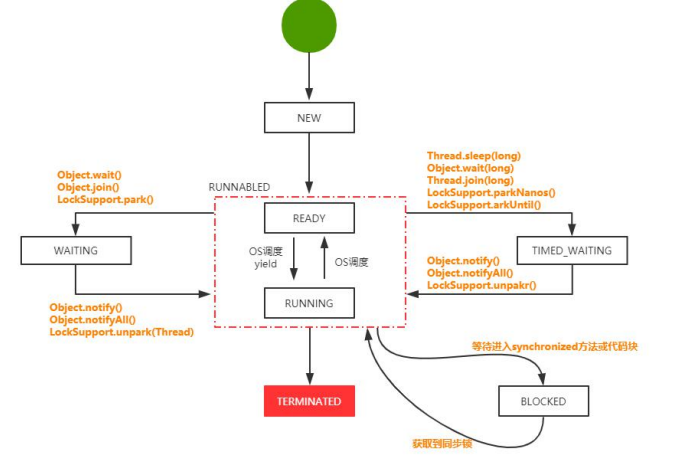

# 并发编程

## 1.线程的基本认识

### 1.1 线程的基本介绍

- 什么是线程？

> 线程是操作系统能够进行运行调度的最小单位，它被包含在进程之中，是进程的实际运作单位。

- 进程的执行逻辑


- 为什么会有线程？

> 1.在多核CPU中，利用多线程可以实现真正意义上的并行执行
>
> 2.在一个应用进程中，会存在多个同时执行的任务，如果其中一个任务 被阻塞，将会引起不依赖该任务的任务也被阻塞。通过对不同任务创 建不同的线程去处理，可以提升程序处理的实时性 
>
> 3.线程可以认为是轻量级的进程，所以线程的创建、销毁比进程更快

### 1.2 线程的应用场景

多线程的本质是：合理的利用多核心CPU资源来实现咸亨的并行处理，来实现同一个进程内的多个任务的并行执行，同时基于线程本身的异步执行特性，提升任务处理的效率。

1. 使用多线程实现文件下载
2. 后台任务：如定时向大量（100W以上）的用户发送邮件
3. 异步处理：记录日志
4. 多步骤的任务处理，可根据步骤特征选用不同个数和特征的线程来协作处理，多任务的分割，由一个主线程分割给多个线程完成。


### 1.3 Java中实现多线程的方式

- 继承Thread类
- 实现Runnable接口
- 实现Callable接口

```java
public class MultiThread01CreateThread {

    public static void main(String[] args) throws ExecutionException, InterruptedException {
        // 继承Thread类型
        ThreadDemo threadDemo = new ThreadDemo();
        threadDemo.start();
        //实现Runnable接口
        RunnableDemo runnableDemo = new RunnableDemo();
        Thread thread = new Thread(runnableDemo);
        thread.start();
        // 实现Callable接口
        ExecutorService executorService = Executors.newFixedThreadPool(1);
        Future<?> future = executorService.submit(new CallableDemo());
        System.out.println(Thread.currentThread().getName() + "返回值->" + future.get());
    }

    /**
     * 继承Thread类实现线程
     */
    public static class ThreadDemo extends Thread {
        @Override
        public void run() {
            System.out.println("继承Thread当前线程：" + Thread.currentThread().getName());
        }
    }

    /**
     * 实现Runnable接口实现线程
     */
    public static class RunnableDemo implements Runnable {

        @Override
        public void run() {
            System.out.println("实现Runnable接口当前线程：" + Thread.currentThread().getName());
        }
    }

    /**
     * 实现Callable接口
     */
    public static class CallableDemo implements Callable<String> {

        @Override
        public String call() throws Exception {
            System.out.println("实现Callable接口当前线程：" + Thread.currentThread().getName());
            Thread.sleep(1000);
            return "Callable线程结束";
        }
    }
}
```

#### 三种创建方式的区别

> 继承Thread类，不能再继承其他类；实现Runnable接口，还可以继承其他类，适用多个线程共享同一个目标；Callable任务执行后有返回值，可以抛出异常信息。

#### start()和run()的区别

> start()方法用来开启线程，但是开启后不一定立即执行，需要获取CPU的执行权后才可以执行
>
> run()方法是由jvm创建完本地操作系统级线程后回调的方法

### 1.4 线程的生命周期

Java线程从创建到销毁，一共经历6个状态

- **NEW:初始状态**，线程被构建，但是还没有调用start方法
- **RUNNABLE：运行状态**，Java线程把操作系统中的就绪和运行两种状态统一称为“运行中”
- **BLOCKED:阻塞状态**，表示线程进入等待状态，也就是线程因为某种原因放弃了CPU使用权，阻塞也分为几种情况
- **WAITTING:等待状态**
- **TIME_WAITTING:超时等待状态**，超时以后自动返回
- **TERMINATED：终止状态**，表示当前线程执行完毕。



## 2. 线程的基本操作及原理

### 2.1 Thread.join()的使用和原理

很多情况下，主线程创建并启动子线程，如果子线程中要进行大量的耗时运算，主线程将可能早于子线程结束。如果主线程需要知道子线程的执行结果时，就需要等待子线程执行结束了。主线程可以sleep(xx),但这样的xx时间不好确定，因为子线程的执行时间不确定，join()方法比较合适这个场景。


简言之，Thread.join是保证线程执行结果的可见性。

```java
public class Operation01JoinDemo {
    private static int x = 1;
    private static int y = 2;

    public static void main(String[] args) throws InterruptedException {
        Thread thread1 = new Thread(() -> {
            x = 2;
            y = 3;
        });

        Thread thread2 = new Thread(() -> {
            y = x + 99;
        });
        thread1.start();
        /**
         * 输出结果可能为3 或者为101
         *
         * 因为线程的执行顺序不一定。如果需要用x=2的值，需要加上thread.join()
         */
        thread1.join();
        thread2.start();
        Thread.sleep(100);
        System.out.println("result:" + y);
    }
}
```

Thread.join()本质上是wait()和notify()


join(long millis)可以设置超时参数，超时未返回会抛异常。

### 2.2 Thread.sleep()

Thread.sleep()使线程暂停执行一段实际，直到等待的时间结束后才恢复执行或在这段时间内被中断。

1. 挂起线程并修改其运行状态
2. 用sleep()提供的参数来设置一个定时器
3. 时间结束，定时器触发，内核收到中断后修改线程的运行状态。例如线程被标志为就绪而进入就绪队列等待调度

```java
public class Operation02SleepDemo extends Thread {
    @Override
    public void run() {
        long start = System.currentTimeMillis();
        try {
            Thread.sleep(3000);
            System.out.println("耗时:" + (System.currentTimeMillis() - start));
            // 耗时：3002
        } catch (InterruptedException e) {
            e.printStackTrace();
        }
    }

    public static void main(String[] args) {
        new Operation02SleepDemo().start();
    }
}
```

**join()和sleep()不同在于，join()内部调用了wait()，会让出锁，而sleep()会一直保持锁。**


### 2.3 wait()和notify()的使用

一个线程修改了一个对象的值，另一个线程感知到变化，并进行响应的操作。

举例，生产者生产包子，消费者消费包子。生产者生产满10个不再生产，以免浪费。那么数量count可以作为生产者和消费者的通信载体，count=10时生产者阻塞，当消费者消费掉包子(count<10)，生产者被唤醒继续生产。count=0时消费者阻塞，当生产者生产了包子后，消费者被唤醒。

```java
// 生产者
public class Operation03Producer implements Runnable {

    private Integer count;
    private Queue<String> bags;

    public Operation03Producer(Integer count, Queue<String> bags) {
        this.count = count;
        this.bags = bags;
    }

    @Override
    public void run() {
        int i = 0;
        while (true) {
            i++;
            synchronized (bags) {
                while (count == bags.size()) {
                    System.out.println("生产满了");
                    try {
                        bags.wait();
                    } catch (InterruptedException e) {
                        e.printStackTrace();
                    }
                }
                try {
                    Thread.sleep(500);
                } catch (InterruptedException e) {
                    e.printStackTrace();
                }
                System.out.println("生产者-生产bags" + i);
                bags.add("bags" + i);
                bags.notifyAll();
            }
        }
    }
}

//消费者
public class Operation04Consumer implements Runnable {
    private Queue<String> bags;
    private Integer count;

    public Operation04Consumer(Queue<String> bags, Integer count) {
        this.bags = bags;
        this.count = count;
    }

    @Override
    public void run() {
        while (true) {
            synchronized (bags) {
                while (bags.size() == 0) {
                    System.out.println("没有包子了");
                    try {
                        bags.wait();
                    } catch (InterruptedException e) {
                        e.printStackTrace();
                    }
                }
                String bag = bags.remove();
                System.out.println("消费者消费：" + bag);
                try {
                    Thread.sleep(500);
                } catch (InterruptedException e) {
                    e.printStackTrace();
                }
                bags.notifyAll();
            }
        }

    }
}

// 案例代码
public class Operation05WaitNotifyMain {
    public static void main(String[] args) {
        Queue<String> bags = new LinkedList<>();
        Integer count = 10;
        Operation03Producer producer = new Operation03Producer(count, bags);
        Operation04Consumer consumer = new Operation04Consumer(bags, count);
        Thread threadProducer = new Thread(producer);
        Thread threadConsumer = new Thread(consumer);
        threadProducer.start();
        threadConsumer.start();
    }
}

```

wait和notify是一种条件的竞争，这种条件是synchronized约束的。

### 2.4 interrupt()和interrupted的使用

如何中止线程？

thread.stop()相当于kill -9，暴力关闭

使用Interrupte()改变线程中的中断状态位，不会停止线程。

Thread.interrupted()对设置中断标识的线程复位，并且返回当前的中断状态

```java
public class Operation06Interrupt {

    public static void main(String[] args) throws InterruptedException {
        Thread thread = new Thread(() -> {
            try {
                Thread.sleep(5000);
            } catch (InterruptedException e) {
                e.printStackTrace();
            }
        });
        thread.start();
        Thread.sleep(3000);
        thread.interrupt();
    }
}

public class Operation07Interrupted {
    public static void main(String[] args) throws InterruptedException {
        Thread thread = new Thread(() -> {
            while (true) {
                //true标识被中断过
                if (Thread.currentThread().isInterrupted()) {
                    System.out.println("before:" + Thread.currentThread().isInterrupted());
                    Thread.interrupted(); // 对中断标识复位 false
                    System.out.println("after:" + Thread.currentThread().isInterrupted());
                }
            }
        });
        thread.start();
        TimeUnit.SECONDS.sleep(1);
        thread.interrupt(); //中断
    }
}
```


## 3. 线程的安全性分析

### 3.1 并发编程问题的源头——原子性、可见性、有序性

**如何理解线程安全？**

​		当多个线程访问某个对象时，不管运行时环境采用和何种调度方式或者这些线程将如何交替执行，并且在主调代码中不需要任何额外的同步或者协同，这个类都能表现正确的行为，那么就称这个类是线程安全的。


**线程安全的源头**

线程安全的本质是：

- 可见性
- 有序性
- 原子性

由于CPU，内存，IO三者之间速度差异，为了提高系统性能，进行优化：

1. CPU增加了告诉缓存，以均衡与内存的速度差异
2. 操作胸痛增加了进程、线程，以分时复用CPU，进而均衡CPU与IO设备的速度差异
3. 编译程序优化指令的执行次序，使得缓存能够得到更加合理地利用。


**Java内存模型**


**可见性问题**

Java内存模型中，所有变量存储在内存中，线程对变量的操作在工作内存中进行。两个线程A和B都能主内存中读取变量X，随后线程A改变了X的值，但由于线程B的CPU缓存的存在，不会去重新读取主内存X的值，因此线程B对变量修改的不可见性。

> 可见性：一个线程对共享变量的修改，另外一个线程能够立刻看到


```java
public class Safety02Visibility {
    public static boolean flag = false;

    public static void main(String[] args) throws InterruptedException {
        Thread thread = new Thread(() -> {
            int i = 0;
            while (!flag) {
                i++;
            }
            System.out.println("result:" + i);
        });
        thread.start();
        System.out.println("begin start thread");
        Thread.sleep(1000);
        flag = true;
    }
}
```

无法输出结果，主线程中的flag改为true后，thread线程不可见，将一直做while循环。


**原子性问题**

 多线程之间的线程切换通常在一条CPU指令执行完毕后，Java作为一门高级编程语言，通常一条语句由多个cpu来完成，例如：count++，至少需要三条指令：

1. count变量从内存加载到cpu寄存器
2. 寄存器中执行+1操作
3. 将结果写入内存

假设count = 0， 有2个线程同时执行count++这段代码。线程A执行完指令1将count = 0加载到cpu寄存器，进行了任务切换到了线程B执行，线程B执行完之后将count = 1写入到内存，然后再切换到线程A执行，此时线程A获取寄存器中的count=0进行+1操作得到结果也是1，所以最终内存中的count = 1，而我们所期望的是2.


```java
public class Safety01Atomic {

    private static int count;

    public static void incr() {
        try {
            Thread.sleep(1);
        } catch (InterruptedException e) {
            e.printStackTrace();
        }
        count++;
    }

    public static void main(String[] args) throws Exception {
        for (int i = 0; i < 1000; i++) {
            new Thread(Safety01Atomic::incr).start();
        }
        Thread.sleep(4000);
        System.out.println("输出结果：" + count); //输出结果：929
    }
}
```


**有序性问题**

为了提高程序的执行效率，编译器有时会在编译过程中对程序的进行优化，从而改变程序的执行顺序。如程序“a = 4； b = 5”，在优化后执行顺序可能变成“b = 5； a = 4”。


例子：


### 3.2 同步关键字Synchronized

**Synchronized关键字可以解决可见性、原子性、有序性问题。**

Synchronized的本质:通过对代码加锁，同一时间只能一个线程执行，其它的线程进入同步队列等待唤醒。


Synchronized锁的范围可以是：

- 对于普通方法，锁是当前实例对象
- 对于静态同步方法，锁是当前类的class对象
- 对于同步方法块，锁是Synchronized括号里配置的对象


Synchronized能够解决线程中的三大问题，它是依赖操作系统实现的，也就是使用synchronized同步锁的时候需要进行用户态到内核态的切换，这种状态的切换非常耗时，因此Synchronized也称为重量级锁。


在JDK1.6以后对synchronized做了优化，引入了自适应自旋锁、偏向锁、轻量级锁，以及锁消除和锁粗化。

**自适应自旋锁**

用户态和内核态的切换非常耗时，统计发现很多线程锁定状态只持续很短时间，这时候引入自旋锁。自旋锁不会加入到等待队列中，而是会执行一个无意义循环，等待线程结束去竞争锁。这样可能会浪费一定资源，但是可以保证大吞吐率和执行效率。自适应自旋锁的自旋次数，是JVM在运行时根据统计到的信息自动调整的。

**偏向锁**

每个对象都有对象头，对象头由Mark World，指向类的指针，以及数组长度三部分组成。

MarkWorld记录了对象和锁有关的信息，其中有锁标志位和偏向锁位。

synchronized升级的步骤是：**偏向锁——>轻量级锁——>重量级锁**


偏向锁的作用是当有线程访问同步代码或方法时，线程只需要判断对象头的Mark Word中判断一下是否有偏向锁指向线程ID。

偏向锁记录过程：

1. 线程抢到了对象的同步锁，锁标志位为01(01表示无锁)
2. 对象MarkWorld将偏向锁位设置为1（1为偏向锁）
3. 记录抢到锁的线程ID
4. 进入偏向状态

当再次访问这个加锁的代码时，通过MarkWorld中去判断一下是否有偏向锁指向他的ID，不需要再去竞争。

**轻量级锁**

当有另外一个线程竞争获取这个锁时，由于该锁已经是偏向锁，当发现对象头 Mark Word 中的线程 ID 不是自己的线程 ID，就会进行 CAS 操作获取锁，如果获取成功，直接替换 Mark Word 中的线程 ID 为自己的 ID，该锁会保持偏向锁状态；如果获取锁失败，代表当前锁有一定的竞争，偏向锁将升级为轻量级锁。

当有其他线程想访问加了轻量级锁的资源时，会使用自旋锁优化，来进行资源访问。


**偏向锁:适用于单线程适用锁的情况**

**轻量级锁：适用于竞争较不激烈的情况(这和乐观锁的使用范围类似)**

**重量级锁：适用于竞争激烈的情况**

### 3.3 volatile关键字分析

**volatile可以用来解决可见性和有效性问题**

使用场景:多个线程对同一个共享变量进行修改的时候

本质上Volatile 实际上是通过内存屏障来防止指令重排以及禁止CPU告诉缓存来解决可见性问题.

```java
public class Safety03Volatile {
    public volatile static boolean flag = false;

    public static void main(String[] args) throws InterruptedException {
        Thread thread = new Thread(() -> {
            int i = 0;
            while (!flag) {
                i++;
            }
            System.out.println("result:" + i);
        });
        thread.start();
        System.out.println("begin start thread");
        Thread.sleep(1000);
        flag = true;
    }
}
```

### 3.4 final域

final的基本用法：

- 当用final修饰一个类时，表明这个类不能被继承。

- 修饰方法把方法锁定，以防任何继承类修改它的含义。

- 对于一个final变量，如果是基本数据类型的变量，则其数值一旦在初始化之后便不能更改；如果是引用类型的变量，则在对其初始化之后便不能再让其指向另一个对象。

对于final域，编译器和处理器要遵守两个重排序的规则。

- 在构造函数内对一个final域的写入，与随后把这个被构造对象的引用赋值给一个引用变量，这两个操作之间不能重排序
- 初次读一个包含final域的对象的引用，与随后初次读这个final域，两个操作之间不能重排序

### 3.5 Happends-Before模型

Happends-Before是一种可见性规则，含义为前一个操作的结果对后续操作是可见的。


六种Happens-Before规则

- 程序顺序规则：单线程中科院体现，即便重排序也不影响结果的正确性
- 监视器锁规则：同一个对象的解锁happends-before后续这个对象的加锁
- Volatile变量规则：对volatile域的写happends-before对这个volatile的读
- 传递性：A happends-before B, B happends-before C，那么A一定Happends-Before C
- Start()规则：线程A执行ThreadB.start()，那么A线程ThreadB.start()操作Happends-Before于线程B的任意操作
- Join()规则：ThreadB.join()的所有操作Happends-Before这之后的代码


### 3.6 原子类操作Aomic

Atomic类可以解决多线程中的原子性问题，原理是使用了CAS。

```java
compareAndSwapInt(Object, offset, expect, update)
 
Object:atomic对象
offset:在内存中的地址
expect:旧的预期值
update:修改的新值
 
更新一个变量的时候，当变量的预期值expect和在内存地址中的值offset相同时，才会将内存地址offset的值修改为update
```


### 3.7 ThreadLocal的使用与原理

[ThreadLocal源码分析](https://www.jianshu.com/p/3c5d7f09dfbd)

```java
public class Safety04ThreadLocal {
    
    public static final ThreadLocal<Integer> local = new ThreadLocal<Integer>() {
        @Override
        protected Integer initialValue() {
            return 0; //初始值
        }
    };

    public static void main(String[] args) {
        Thread[] threads = new Thread[5];
        //希望每个线程都拿到的是0
        for (int i = 0; i < 5; i++) {
            threads[i] = new Thread(() -> {
                int num = local.get(); //拿到初始值
                num += 5;
                local.set(num);
                System.out.println(Thread.currentThread().getName() + "->" + num);
            }, "Thread-" + (i+1));
        }
        for (Thread thread : threads) {
            thread.start();
        }
    }
}
```


## 4. JUC核心之AQS

### 4.1 重入锁ReentrantLock的初步认识

**什么是锁？**

锁是用来解决多线程并发访问共享资源所带来的数据安全性问题的手段。对一个共享资源加锁后，如果有一个线程获得了锁，那么其他线程无法访问这个共享资源。


**什么是重入锁？**

一个持有锁的线程，在释放锁之前，如果再次访问了该同步锁的其他的方法，那么这个线程不需要再次争抢锁，只需要记录重入次数。

### 4.2 AQS是什么

**AQS原理**

AQS(AbstractQueuedSynchonizer)抽象的队列式同步器，是Java自带的synchronized关键字之外的锁机制。**核心思想**是，如果请求的共享资源空闲，那么请求线程设置为有效的工作线程，并将共享资源设置为锁定状态；如果被请求的资源被占用，需要一套线程阻塞等待以及被唤醒时锁分配机制，这个机制AQS是用CLH队列锁实现的，将暂时获取不到的锁加入到队列中。

CLH队列是一个虚拟的双向队列，虚拟的双向队列即不存在队列实例，仅存在节点之间的关联关系。

**AQS是将每一条请求共享资源的线程封装成一个CLH锁队列的一个节点，来实现锁的分配。**


简而言之，AQS是基于CLH队列，用volatie修饰共享变量state，线程通过CAS去改变状态符，成功则获取锁成功，失败则进入等待队列，等待被唤醒。


### 4.3 CountDownLathch的使用

countdownlatch是一个同步工具类，它允许一个或多个线程一直 等待，直到其他线程的操作执行完毕再执行。从命名可以解读到 countdown是倒数的意思，类似于我们倒计时的概念。

```java
public class JUC01CountDownLatch {

    public static void main(String[] args) throws InterruptedException {
        CountDownLatch countDownLatch = new CountDownLatch(3);

        new Thread(()->{
            System.out.println("线程1执行完毕");
            countDownLatch.countDown();
        }).start();

        new Thread(()->{
            try {
                Thread.sleep(3000);
                System.out.println("线程2执行完毕");
                countDownLatch.countDown();
            } catch (InterruptedException e) {
                e.printStackTrace();
            }
        }).start();

        new Thread(()->{
            System.out.println("线程3执行完毕");
            countDownLatch.countDown();
        }).start();

        countDownLatch.await();
        System.out.println("主线程执行完毕");
    }
}
```


### 4.4 Semaphore源码分析

Semaphore有时被称为信号灯，是在多线程环境下使用的一种设施, 它负责协调各个线程, 以保证它们能够正确、合理的使用公共资源。

**什么是信号量(Semaphore）**
　　Semaphore分为单值和多值两种，前者只能被一个线程获得，后者可以被若干个线程获得。
　　以一个停车场是运作为例。为了简单起见，假设停车场只有五个车位，一开始五个车位都是空的。这是如果同时来了十辆车，看门人允许其中五辆不受阻碍的进入，然后放下车拦，剩下的车则必须在入口等待，此后来的车也都不得不在入口处等待。这时，有一辆车离开停车场，看门人得知后，打开车拦，放入一辆，如果又离开两辆，则又可以放入两辆，如此往复。
　　在这个停车场系统中，车位是公共资源，每辆车好比一个线程，看门人起的就是信号量的作用。
　　更进一步，信号量的特性如下：信号量是一个非负整数（车位数），所有通过它的线程（车辆）都会将该整数减一（通过它当然是为了使用资源），当该整数值为零时，所有试图通过它的线程都将处于等待状态。在信号量上我们定义两种操作： Wait（等待） 和 Release（释放）。 当一个线程调用Wait等待）操作时，它要么通过然后将信号量减一，要么一自等下去，直到信号量大于一或超时。Release（释放）实际上是在信号量上执行加操作，对应于车辆离开停车场，该操作之所以叫做“释放”是应为加操作实际上是释放了由信号量守护的资源。

```java
public class Juc02Semaphore {
    public static void main(String[] args) {
        //当前可以获得的最大许可数量是5个
        //AQS   ->state
        Semaphore semaphore = new Semaphore(5);
        for (int i = 0; i < 10; i++) {
            new Car(i, semaphore).start();
        }
    }

    static class Car extends Thread {
        private int num;
        private Semaphore semaphore;

        public Car(int num, Semaphore semaphore) {
            this.num = num;
            this.semaphore = semaphore;
        }

        @Override
        public void run() {
            try {
                semaphore.acquire(); //获得一个许可,如果获取不到许可，就会被阻塞
                System.out.println("第" + num + " 占用一个停车位");
                TimeUnit.SECONDS.sleep(2);
                System.out.println("第" + num + "  辆车走了");
                semaphore.release(); //释放许可
            } catch (InterruptedException e) {
                e.printStackTrace();
            }
        }
    }
}

```


### 4.5 CyclicBarrier的应用和原理

CyclicBarrier 的字面意思是可循环使用（Cyclic）的屏障（Barrier）。它要 做的事情是，让一组线程到达一个屏障（也可以叫同步点）时被阻塞，直到最 后一个线程到达屏障时，屏障才会开门，所有被屏障拦截的线程才会继续工作。

**使用场景**

当存在需要所有的子任务都完成时，才执行主任务，这个时候就可以选 择使用CyclicBarrier。


### 4.7 Contion条件

Condition是一个多线程协调通信的工具类，可以让某些线程一起等待 某个条件（condition），只有满足条件时，线程才会被唤醒。

## 5. 线程调度之线程池

> 池化技术包括线程池、数据库连接池、HTTP连接池都是对这个思想的利用。池化技术主要是为了减少每次获取资源的消耗，提高对资源的利用率。

在面向对象编程中，创建和销毁线程都是很耗费时间的：创建一个对象需要获取内存资源或者其它更多资源。在Java中，虚拟机会试图跟踪每一个对象，以便能够在对象销毁后进行垃圾回收。所以提高服务程序效率的一个手段就是尽可能减少创建和销毁对象的次数，特别是一些很耗资源对象的创建和销毁。  

**优点**：

- 降低资源消耗：重用存在的线程，减少对象创建销毁的开销
- 提高响应速度：可以有效控制最大的并发线程数，提高系统资源的使用率，同时避免过多资源竞争，避免阻塞。当任务到达时，任务可以不需要等到线程创建就能立即执行。
- 提高线程的可管理性。线程是稀缺资源，如果无限制创建，会消耗系统资源，降低系统的稳定性，使用线程可以进行统一分配，调优和监控。
- 附加功能：提供定时执行、定期执行、单线程、并发数控制等功能

**线程池的构造方法**


**线程池的原理**


#### 5.1 线程池的几种创建方式

Java5+中的Executor接口定义一个执行线程的工具。它的子类型即线程池接口是ExecutorService，工具类Executors提供了一些静态工厂方法，生成一些常用的线程池：
1. newSingleThreadExecutor：创建一个单线程的线程池，相当于一个线程执行所有的任务。如果这个唯一的线程因为异常结束，会有一个新的线程来替代它，此线程池保证所有任务的执行顺序按照任务的提交顺序执行。
2. newFixedThreadPool：创建固定大小的线程池。每次提交一个任务就创建一个线程，直到线程达到线程池的最大大小。线程池的大小一旦达到最大值就会保持不变，如果某个线程因为执行异常而结束，那么线程池会补充一个新线程。
3. newCachedThreadPool:创建一个可缓存的线程池。如果线程池的大小超过了处理任务所需要的线程，那么就会回收部分空闲的线程，当任务增加时，线程池可以新增线程来处理任务。该线程池不会对线程池大小做限制，线程池大小完全依赖于JVM能够创建的最大线程数。
4. newScheduledThreadPool:创建一个大小无线的线程池。此线程池支持定时以及周期执行任务的需求。

#### 5.2 线程池有哪些状态？
- RUNNING：这是最正常的状态，接受新的任务，处理等待队列中的任务。
- SHUTDOWN：不接受新的任务提交，但是会继续处理等待队列中的任务。
- STOP：不接受新的任务提交，不再处理等待队列中的任务，中断正在执行任务的线程。
- TIDYING：所有的任务都销毁了，workCount为0，线程池的状态转换为TIDYING状态时，会执行钩子方法terminated()
- TERMINATED：terminated()方法结束后，线程池的状态就会变成这个。

