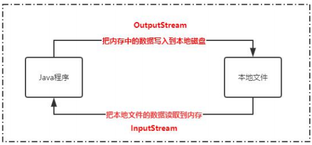

# 网络IO 

## 1. 初步认识IO

> I/O实际上是input和output，也就是输入和输出。而流其实是一种抽象 的概念，它表示的是数据的无结构化传递

### 1.1什么是IO流及作用

**IO流的作用**

**IO流的应用场景**

### 1.2 Java中的IO流及分类

Java中的IO体系

### 1.3 IO流应用实战 

## 深入分析Java中的IO流

## 网络IO

## 深入分析NIO