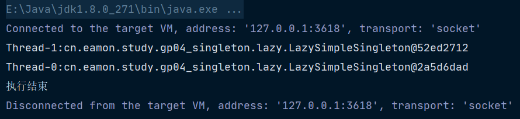
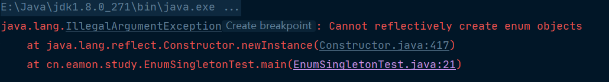
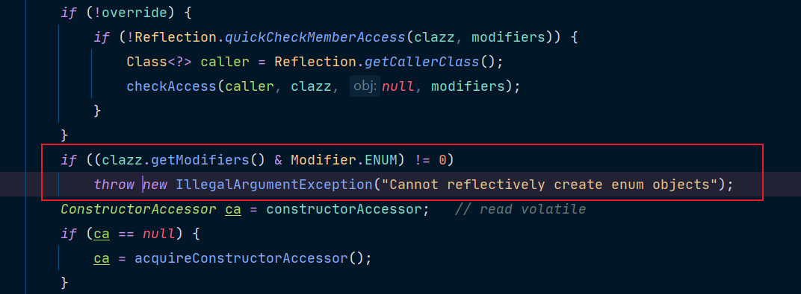

# 设计模式


[toc]
## 六大设计原则
> 设计模式是一套理论，是软件界的先辈们总结出的一套可以反复使用的经验。它可以提高代码的可重用性，增强系统的可维护性，以及解决一系列的复杂问题。

在学习设计模式之前，先要明白六大设计原则，设计模式是在六大设计原则上的实践。

### 开闭原则

- 开闭原则定义：软件实体应该对扩展开放，对修改关闭。
- 开闭原则的好处：
  - 可以减少测试的工作量
  - 可以提高复用性
  - 可以提高可维护性
  - 面向对象开发的要求

### 单一职责原则

- 单一职责的定义是：应该有且仅有一个原因引起类的变更
- 单一职责的好处：
    - 类的复杂度降低，实现什么职责都有清晰明确的定义
    - 可读性提高
    - 可维护性提高
    - 变更引起风险降低
- 在写代码的时候，尽量做到单一职责。但职责的划分很难确认，要根据环境、项目、资源等而定，但还是尽量做到类的设计只有一个原因引起变化。

### 接口隔离原则

- 接口隔离原则的定义：
  - 客户端不应该依赖它不需要的接口
  - 类间的依赖关系应该建立在最小的接口上

> 总结一句话是：建立单一接口，不要建立臃肿庞大的接口。再通俗点就是：接口尽量细化，同时接口的方法尽量少。

```html
接口隔离原则和单一职责原则是相同的吗？

是不同的。单一职责注重的是职责，要求职责单一，属于业务逻辑上的划分。接口隔离原则要求接口的方法尽量少，当二者发生冲突时，首先满足单一职责原则。
```

- 接口隔离原则也就是要做到高内聚。
- 接口的设计粒度越小，系统越灵活，但是灵活的同时也带来了结构的复杂化，开发难度增加，可维护性降低。需要深入了解业务逻辑，根据经验和常识决定接口的粒度大小，太小增加开发工作量，太大灵活度降低。

### 迪米特法则

- 迪米特法则：一个对象应该对其他对象有最少的了解。
- 迪米特法则的核心观念就是类间的解耦，弱耦合，类的复用率才可以提供。如果一个方法放在本类中，既不增加类间关系，也不对本类产生负面影响，那就放置在本类中。

### 里氏替换原则

- 里式替换原则的定义：只要父类能出现的地方子类就可以出现，而且替代为子类也不会产生任何错误和异常，使用者可能根本不需要知道谁是父类谁是子类。但是，反过来就不行了，有子类出现的地方，父类未必能适应。
- 里式替换原则的目的就是增强程序的健壮性，版本升级时也可以保持非常好的兼容性。即使增加子类，原有的子类还可以继续运行。

### 依赖倒置原则
- 依赖倒置的表现：
    1. 模块间的依赖通过抽象发生，实现类之间不发生直接的依赖关系，其依赖关系是通过接口或抽象类产生的。
    2. 接口或抽象类不依赖于实现类。
    3. 实现类依赖接口或抽象类。

> 更加精简的定位是“面向接口编程”

- 采用依赖倒置原则可以减少类间的耦合性，提高系统的稳定性，降低并行开发引起的风险，提高代码的可读性和可维护性。
- 依赖倒置原则的本质就是通过抽象使各个类或模块的实现彼此独立，不互相影响，实现模块间的松耦合。核心就是“面向接口编程”
> 为什么叫“倒置”，首先说“正置”是什么意思，依赖正置就是类间的依赖是实实在在的实现类间的依赖，也就是面向实现编程，也是正常生活的思维，要开车就依赖车，要用电脑就依赖电脑，而编写程序需要对现实世界的事物进行抽象，抽象的结果就是有了抽象类和接口，然后我们根据系统设计的需要产生了抽象间的依赖，代替了人们传统思维中的事物间的依赖，“倒置”就是从这里产生的。

## 简单工厂模式

> 简单工厂模式是指由一个工厂对象决定创建出哪一种产品类的实例，属于创建者模式，但它不属于23种设计模式。

最直观的思维方式是需要什么，创建什么。例如我需要一门课程，那么就创建一门课程来：

```java
public class MathCourse {

    public void  create(){
        System.out.println("MathCourse创建数学课程");
    }
}

public class Test {
    public static void main(String[] args) {
        // 直接创建
        MathCourse mathCourse = new MathCourse();
        mathCourse.create();
    }
}

输出：
MathCourse创建数学课程
```

但是如果用户同时需要英语课、语文课、政治课...等，那么则需要创建多个课程。根据六大设计原则之一的依赖倒置原则：面向接口编程。可以新建一个学科接口类，实际学科去实现这个接口类：

```java
public interface Course {

    /**
     * 创建课程
     */
    void create();
}

public class MathCourseImpl implements Course {
    @Override
    public void create() {
        System.out.println("MathCourseImpl创建了数学课程");
    }
}

public class EnglishCourseImpl implements Course {
    @Override
    public void create() {
        System.out.println("EnglishCourseIml创建了英语课程");
    }
}

public class Test {
    public static void main(String[] args) {
       // 面向接口创建
        Course course = new MathCourseImpl();
        course.create();
        Course course1 = new EnglishCourseImpl();
        course1.create();
    }
}

输出：
MathCourseImpl创建了数学课程
EnglishCourseImpl创建了英语课程
```

面向接口编程提高了代码的可读性和可维护性，但是目前所有课程还是用户自己new出来的，如果创建过程比较麻烦，这样用户还需要了解每种课程(然而**用户并不关心课程如何创建的，只需要使用**)。这里可以提供一种工厂类，使用工厂类只要传入用户想要的东西，就可以返回结果，而不需要用户关注具体的创建过程，实现类之间的解耦。

```java
public class CourseFactory {
    /**
     * 通过if判断创建
     */
    public Course createByIf(String name) {
        if ("math".equals(name)) {
            return new MathCourseImpl();
        } else if ("english".equals(name)) {
            return new EnglishCourseImpl();
        } else {
            return null;
        }
    }
}

public class Test {
    public static void main(String[] args) {
        // 简单工厂创建
        // 通过if判断创建
        CourseFactory courseFactory = new CourseFactory();
        Course mathCourseIf = courseFactory.createByIf("math");
        System.out.println("=======if=========");
        mathCourseIf.create();
        System.out.println("=======if=========");
}

输出：
=======if=========
MathCourseImpl创建了数学课程
=======if=========
```

上面代码提供了工厂类，只需要传入相应的学科名就可以创建对应的课程类。如果课程很多，那么将会有很多的if、else判断，可以对工厂使用反射的方法进行优化。

```java
public class CourseFactory {
    /**
     * 通过反射创建
     */
    public Course createByReflect(String name) {
        try {
            if (!(null == name || "".equals(name))) {
                return (Course) Class.forName(name).newInstance();
            }
        } catch (Exception e) {
            e.printStackTrace();
            System.out.println("创建" + name + "实例失败！");
        }
        return null;
    }
}

public class Test {
    public static void main(String[] args) {
        // 通过反射创建
        System.out.println("=======reflect=========");
   courseFactory.createByReflect("cn.eamon.study.gp01_simple_factory.EnglishCourseImpl").create();
        System.out.println("=======reflect=========");
    }
}

输出：
=======reflect=========
EnglishCourse创建了英语课程
=======reflect=========
```

通过反射创建实例，能很好优化代码，但是在实际使用的时候对传参要求很高，需要输入类的全路径名称。再结合泛型可以继续优化代码：

```java
public class CourseFactory {
    /**
     * 通过反射+泛型指定创建类型课程
     */
    public Course createByReflectExtends(Class<? extends Course> clazz){
        try{
            if(null!=clazz){
                return clazz.newInstance();
            }
        }catch (Exception e){
            e.printStackTrace();
            System.out.println("创建" + clazz + "实例失败！");
        }
        return null;
    }
}

public class Test {
    public static void main(String[] args) {
        // 通过反射+泛型指定创建课程
        System.out.println("=======reflect+extends=========");
        courseFactory.createByReflectExtends(MathCourseImpl.class).create();
        System.out.println("=======reflect+extends=========");
    }
}

输出：
=======reflect+extends=========
MathCourseImpl创建了数学课程
=======reflect+extends=========
```

通过泛型传递，这样开发工具在你传参的时候，还能够智能化提醒，进一步增加使用的便捷性。


看看Calendar类是如何实例化的Calendar.getInstance()：

```java
public static Calendar getInstance()
    {
    	// 工厂创建Calendar实例
        return createCalendar(TimeZone.getDefault(), Locale.getDefault(Locale.Category.FORMAT));
    }

private static Calendar createCalendar(TimeZone zone,
                                           Locale aLocale)
    {
        CalendarProvider provider =
            // 工厂创建Calendar实例
            LocaleProviderAdapter.getAdapter(CalendarProvider.class, aLocale) 
                                 .getCalendarProvider();
        if (provider != null) {
            try {
                return provider.getInstance(zone, aLocale);
            } catch (IllegalArgumentException iae) {
                // fall back to the default instantiation
            }
        }
    ···
}

// 使用泛型指定入参类型
 public static LocaleProviderAdapter getAdapter(Class<? extends LocaleServiceProvider> var0, Locale var1) {...}
```


**简单工厂的优点**：只需要传入一个正确的参数，就可以获取你所需要的对象，无须知道其创建的细节。

**简单工厂的缺点**：工厂类的职责过重，增加新的场景时需要修改工厂类的判断逻辑，违背开闭原则；不易于扩展复杂的产品结构。

**适用场景**：工厂类负责创建的对象较少。

## 工厂方法模式

> 工厂方法模式是指定义一个创建对象的接口，但让实现这个接口的类来决定实例化哪个类，工厂方法让类的实例化推迟到子类中进行。

在简单工厂中提到**简单工厂的缺点是职责过重，既不符合单一原则也不符合开闭原则**，如何工厂方法模式在一定程度上可以解决简单工厂的缺点。

同样是面向课程接口实现具体的课程类：

```java
public interface ICourse {

    /**
     * 创建课程
     */
    void create();
}

public class EnglishCourseImpl implements ICourse {
    @Override
    public void create() {
        System.out.println("EnglishCourseImpl创建了英语课程");
    }
}

public class MathCourseImpl implements ICourse {
    @Override
    public void create() {
        System.out.println("MathCourseImpl创建了数学课程");
    }
}
```

与简单工厂的区别，进一步将工厂同课程面向接口编程：

```java
public interface ICourseFactory {
    /**
     * 创建课程工厂
     */
    ICourse create();
}

public class EnglishCourseFactory implements ICourseFactory {
    @Override
    public ICourse create() {
        return new EnglishCourseImpl();
    }
}

public class MathCourseFactory implements ICourseFactory {
    @Override
    public ICourse create() {
        return new MathCourseImpl();
    }
}
```

这样在用户使用的时候便可以实例化不同的工厂类，创建具体的课程：

```java
public class Test {
    public static void main(String[] args) {
        // 数学课程
        ICourseFactory factory = new MathCourseFactory();
        ICourse course = factory.create();
        course.create();
        // 英语课程
        factory = new EnglishCourseFactory();
        factory.create().create();
    }
}

输出：
MathCourseImpl创建了数学课程
EnglishCourseImpl创建了英语课程
```


相比较于简单工厂，它用户更好的扩展性；当出现新的应用场景时，只需要新增一个接口的实现类即可，不需要修改原来的代码。符合单一职责、接口隔离以及依赖倒置原则。


在slf4j中工厂方法模式的应用


**工厂方法模式的优点**

- 有良好的封装性，代码结构清晰：创建产品对象，不需要知道创建过程，只要知道类名就可以，降低模块间的耦合。
- 工厂方法模式符合开闭原则，扩展性非常优秀：想要增加产品类，只要适当修改具体的工厂类或者扩展一个工厂类，就可以“拥抱变化”。

**工厂方法模式的缺点**

- 类的个数容易过多，增加了代码结构的复杂度
- 增加了系统的抽象性和理解难度

**适用场景**

- 创建对象需要大量重复的代码
- 客户端不依赖产品类如何被创建、实现等细节

## 抽象工厂模式

> 抽象工厂模式是指提供一个创建一系列相关或相互依赖对象的接口，无须指定他们具体的类。

在工厂方法模式提到其缺点是**类的个数过多，增加了代码结构的复杂度**，抽象工厂模式可以一定程度上解决工厂方法模式的缺点。抽象工厂模式根据业务属性将接口粗化，将相关的接口方法定义在同一个接口类中。


在学习课程的时候，是会做笔记和回答老师的提问。也就是说每个课程都会做笔记方法和回答问题的方法，在创建课程的时候一并实现做笔记方法和回答问题方法。先定义好相关的接口和类：

课程接口和实现类

```java
public interface ICourse {

    /**
     * 创建课程
     */
    void create();
}

public class EnglishCourseImpl implements ICourse {
    @Override
    public void create() {
        System.out.println("EnglishCourse创建了英语课程");
    }
}

public class MathCourseImpl implements ICourse {
    @Override
    public void create() {
        System.out.println("MathCourseImpl创建了数学课程");
    }
}

```

回答问题接口和实现类

```java
public interface IAnswer {
    /**
     * 回答问题
     */
    void speak();
}

public class EnglishAnswerImpl implements IAnswer {
    @Override
    public void speak() {
        System.out.println("回答英语问题");
    }
}

public class MathAnswerImpl implements IAnswer {
    @Override
    public void speak() {
        System.out.println("回答数学问题");
    }
}
```

笔记接口和实现类

```java
public interface INote {
    /**
     * 做笔记
     */
    void edit();
}

public class EnglishNoteImpl implements INote {
    @Override
    public void edit() {
        System.out.println("写英语笔记");
    }
}

public class MathNoteImpl implements INote {
    @Override
    public void edit() {
        System.out.println("写数学笔记");
    }
}
```

接着定义课程抽象工厂

```java
public abstract class CourseFactory {
    public void init(){
        System.out.println("初始化参数");
    }

    /**
     * 创建笔记
     */
    public abstract INote createNote();

    /**
     * 回答问题
     */
    public abstract IAnswer createAnswer();
}


public class EnglishCourseFactory extends CourseFactory {
    @Override
    public INote createNote() {
        return new EnglishNoteImpl();
    }

    @Override
    public IAnswer createAnswer() {
        return new EnglishAnswerImpl();
    }
}

public class MathCourseFactory extends CourseFactory {
    @Override
    public INote createNote() {
        super.init();
        return new MathNoteImpl();
    }

    @Override
    public IAnswer createAnswer() {
        return new MathAnswerImpl();
    }
}
```

客户端使用：

```java
public class Test {

    public static void main(String[] args) {
        CourseFactory factory = new MathCourseFactory();
        factory.createNote().edit();
        factory.createAnswer().speak();
    }
}
输出：
初始化参数
写数学笔记
回答数学问题
```

**抽象工厂模式的优点**

- 具体产品在应用层代码隔离，无须关系创建细节
- 将一个系列的产品族统一到一起创建

**抽象工厂模式的优点**

- 规定了所有可能被创建的产品集合，产品族扩展新的产品困难，需要修改抽象工厂的接口
- 增加了系统的抽象性和理解难度

**适用范围**

- 强调一系列相关的产品对象一起使用，创建对象需要大量重复代码
- 客户端不依赖于产品类如何被创建、实现等细节


**简单工厂、工厂方法、抽象工厂三者的理解**

> 在一些简单场景，且未来可能不发生变化或变化较少的情况下使用简单工厂；
>
> 较复杂的情况下使用工厂方法；
>
> 抽象工厂需要结合业务理解和发展来考虑的，在设计和开发期间比较难考虑产品的未来发展，通常使用工厂方法模式即可；面对已有的并且有大量重复代码可以使用抽象工厂模式进行代码优化。

## 单例模式

> 单例模式能够确保某一个类只有一个实例，并提供一个全局访问点。单例隐藏了所有的构造方法，属于创建型模式。

### 饿汉式单例

一个简单的饿汉式单例，在类初始化的时候创建。

```java
public class HungrySingleton {

    private static final HungrySingleton hungrySingleton = new HungrySingleton();

    public HungrySingleton() {
    }

    public static HungrySingleton getInstance() {
        return hungrySingleton;
    }
}
```

优点：执行效率高，性能高，没有任何的锁

缺点：某些情况下，会造成浪费内存

### 懒汉式单例 

#### 线程不安全懒汉式

一个简单的饿汉式单例，需要的时候才创建实例。

```java
public class LazySimpleSingleton {

    private static LazySimpleSingleton instance;

    private LazySimpleSingleton() {
    }

    public static LazySimpleSingleton getInstance() {
        if (instance == null) {
            instance = new LazySimpleSingleton();
        }
        return instance;
    }
}
```

优点：节省了内存

缺点：线程不安全


线程不安全是如何体现的，示例:

```java
// 实现一个线程类
public class ExecutorThread implements Runnable {
    @Override
    public void run() {
        LazySimpleSingleton instance = LazySimpleSingleton.getInstance();
        System.out.println(Thread.currentThread().getName() + ":" + instance);
    }
}

// 测试方法
public class LazySimpleSingletonTest {

    public static void main(String[] args) {
        Thread t1 = new Thread(new ExecutorThread());
        Thread t2 = new Thread(new ExecutorThread());
        t1.start();
        t2.start();
        System.out.println("执行结束");
    }
}
```

出现两种运行结果：




- 结果出现同一个实例
  1. 正常顺序执行
  2. 后者覆盖前者

- 出现不同的实例
  1. 同时进入条件，按顺序返回

原因是创建实例时**`instance = new LazySimpleSingleton();`**不是一个原子类操作，存在线程风险。

#### synchronized安全懒汉式单例

那么我们只要给创建实例的方法加一个synchronized关键字就可以解决线程风险的问题：

```java
public class LazySimpleSingleton {
	
    private synchronized static LazySimpleSingleton instance;

    private LazySimpleSingleton() {
    }

    public static LazySimpleSingleton getInstance() {
        if (instance == null) {
            instance = new LazySimpleSingleton();
        }
        return instance;
    }
}
```

此时饿汉式单例能够节省内存，同时线程安全；但是加锁后有明显的性能瓶颈！


优化的第一个思路是降低锁的粒度，由方法级粒度到代码级粒度

```java
public class LazyDoubleCheckSimpleSingleton {

    private static LazyDoubleCheckSimpleSingleton instance;

    private LazyDoubleCheckSimpleSingleton() {
    }

    public  static LazyDoubleCheckSimpleSingleton getInstance() {
        synchronized(LazyDoubleCheckSimpleSingleton.class){
            if (instance == null) {
                instance = new LazyDoubleCheckSimpleSingleton();
            }
        }
        return instance;
    }
}
```

锁粒度的缩小并没有解决核心问题—多个线程每次同时获取实例时都会阻塞；进一步优化将阻塞到第一次创建实例时，因为在instance不为空的时候没必要阻塞，会跳过实例化的过程。

```java
public class LazyDoubleCheckSimpleSingleton {

    private static LazyDoubleCheckSimpleSingleton instance;

    private LazyDoubleCheckSimpleSingleton() {
    }

    public static LazyDoubleCheckSimpleSingleton getInstance() {
        if (instance == null) {
            synchronized (LazyDoubleCheckSimpleSingleton.class) {
                instance = new LazyDoubleCheckSimpleSingleton();
            }
        }
        return instance;
    }
}
```

如上代码，只有在实例不等于空的时候，才会阻塞，这样大大降低了阻塞的概率。但同时引发了另一个问题，线程1和线程2同时执行到synchronized代码块时，线程1获得CPU执行权成功new了新实例，接着线程2获取CPU执行权将又会执行一遍new实例，此时线程2获取的新实例会覆盖线程1获取的实例。起初引入synchronized关键字是为了解决重复创建的问题，但是有了性能瓶颈，优化着又回到了原点。

#### 双重检查锁单例

此时可以用双重检查锁同时解决以上问题：

```java
public class LazyDoubleCheckSimpleSingleton {

    private static LazyDoubleCheckSimpleSingleton instance;

    private LazyDoubleCheckSimpleSingleton() {
    }

    public static LazyDoubleCheckSimpleSingleton getInstance() {
        // 检查是否需要阻塞
        if (instance == null) {
            synchronized (LazyDoubleCheckSimpleSingleton.class) {
                // 检查是否还要创建单例
                if (instance == null) {
                    instance = new LazyDoubleCheckSimpleSingleton();
                }
            }
        }
        return instance;
    }
}
```

双重检查锁解决了线程不安全问题，同时大大优化了性能问题；可它也还是有问题的，线程还有个指令重排序的问题：创建对象实例时，会分为三步：

1. 分配对象内存
2. 调用构造器方法，执行初始化
3. 将对象引用赋值给变量

虚拟机实际运行时，为优化程序性能可能发生重排序。步骤 2,3 可能发生重排序，但是并不会重排序 1 的顺序。也就是说 1 这个指令都需要先执行，因为 2,3 指令需要依托 1 指令执行结果。在单例环境种，不会影响执行结果，但是多线程可能会带来一些问题：

|      | 线程1      | 线程2                      |
| ---- | ---------- | -------------------------- |
| t1   | 分配内存   |                            |
| t2   | 变量赋值   |                            |
| t3   |            | 判断对象是否为null         |
| t4   |            | 由于对象不为null，访问对象 |
| t5   | 初始化对象 |                            |

上面双重检查锁中，如果线程 1 获取到锁进入创建对象实例，这个时候发生了指令重排序。当线程1 执行到 t3 时刻，线程 2 刚好进入，由于此时对象已经不为 Null，所以线程 2 可以自由访问该对象。然后该对象还未初始化，所以线程 2 访问时将会发生异常。

#### 完善的双重检查锁

双重检查锁定模式需要需要使用 `volatile`。`volatile`主要包含两个功能。

1. 保证可见性。使用 `volatile` 定义的变量，将会保证对所有线程的可见性。
2. **禁止指令重排序优化。**

```java
public class LazyDoubleCheckSimpleSingleton {
    /**
     * volatile解决指令重排序的问题
     */
    private volatile static LazyDoubleCheckSimpleSingleton instance;

    private LazyDoubleCheckSimpleSingleton() {
    }

    public static LazyDoubleCheckSimpleSingleton getInstance() {
        // 检查是否需要阻塞
        if (instance == null) {
            synchronized (LazyDoubleCheckSimpleSingleton.class) {
                // 检查是否还要创建单例
                if (instance == null) {
                    instance = new LazyDoubleCheckSimpleSingleton();
                }
            }
        }
        return instance;
    }
}
```

 双重检查锁：

	- 性能高，线程安全
	- 代码可读性难度加大，不够优雅

如何实现一个性能高，线程又安全，且优雅的单例？

#### Java内部类创建单例

```
Java特性：静态内部类在初始化的时候不会被读取，在使用的时候才会加载
```

```java
public class LazyStaticInnerClassSingleton {

    private LazyStaticInnerClassSingleton(){}

    private static LazyStaticInnerClassSingleton getInstance(){
        return LazyHolder.INSTANCE;
    }

    /**
     * 静态内部类
     * 看似是饿汉式单例，实际是懒汉式单例
     * Java特性：静态内部类在初始化的时候不会被读取，在使用的时候才会加载
     * LazyStaticInnerClassSingleton.class
     * LazyStaticInnerClassSingleton$LazyHolder.class
     *
     * 优点：写法优雅，性能高，避免了内存浪费，线程安全
     * 缺点：能够被反射破坏
     */
    private static class LazyHolder{
        private static final  LazyStaticInnerClassSingleton INSTANCE = new LazyStaticInnerClassSingleton();
    }
}
```

利用Java特性实现了看似完美的单例，同时满足性能高、线程安全且足够优雅的单例；但这种方式还有一个隐患，能够被反射破坏。

```java
public class ReflectTest {

    public static void main(String[] args) {
        try {
            Class<?> clazz = LazyStaticInnerClassSingleton.class;
            Constructor declaredConstructor = clazz.getDeclaredConstructor();
            declaredConstructor.setAccessible(true);
            Object instance1 = declaredConstructor.newInstance();
            Object instance2 = declaredConstructor.newInstance();
            System.out.println(instance1 == instance2);
        } catch (Exception e) {
            e.printStackTrace();
        }
    }
}

输出结果：false
```

足以可见利用内部静态类的方式会被反射所破坏...是否可以解决这问题？在构造方法种判断是否存在单例可以解决反射破坏的问题

```java
public class LazyStaticInnerClassSingleton {

    private LazyStaticInnerClassSingleton(){
        // 解决反射破坏单例的问题
        if(LazyHolder.INSTANCE != null){
            throw new RuntimeException("不允许非法访问！");
        }
    }

    private static LazyStaticInnerClassSingleton getInstance(){
        return LazyHolder.INSTANCE;
    }

    /**
     * 静态内部类
     * 看似是饿汉式单例，实际是懒汉式单例
     * Java特性：静态内部类在初始化的时候不会被读取，在使用的时候才会加载
     * LazyStaticInnerClassSingleton.class
     * LazyStaticInnerClassSingleton$LazyHolder.class
     *
     * 优点：写法优雅，性能高，避免了内存浪费，线程安全
     * 缺点：能够被反射破坏
     */
    private static class LazyHolder{
        private static final  LazyStaticInnerClassSingleton INSTANCE = new LazyStaticInnerClassSingleton();
    }
}
```

在构建方法种抛出异常，又回到代码阅读比较困难，不够优雅的问题。

### 注册式单例

在《Java Effective》里面推荐使用枚举式单例。

```java
public enum EnumSingleton {
    /**
     * 全局唯一单例
     */
    INSTANCE;

    private Object data;

    public Object getData() {
        return data;
    }

    public void setData(Object data) {
        this.data = data;
    }

    public static EnumSingleton getInstance() {
        return INSTANCE;
    }
}


public class EnumSingletonTest {

    public static void main(String[] args) {
         // 使用枚举类操作单例
        EnumSingleton instance = EnumSingleton.getInstance();
        // 设置单例
        instance.setData(new Object());
        // 获取单例
        Object data = instance.getData();
        System.out.println(data);
        
        try {
//            Enum
            Class<?> clazz = EnumSingleton.class;
            Constructor declaredConstructor = clazz.getDeclaredConstructor(String.class, int.class);
            declaredConstructor.setAccessible(true);
            Object instance1 = declaredConstructor.newInstance();
            Object instance2 = declaredConstructor.newInstance();
            System.out.println(instance1 == instance2);
        } catch (Exception e) {
            e.printStackTrace();
        }
    }
}
```

这时候使用反射获取单例，同样提示报错



原因是枚举类继承enum，内部做了限制：



当修饰符是enum时，会抛出异常，不能使用反射创建单例。

*Enum类是如何保证单例的创建？*

Enum类有一个valuesOf的方法，可以通过传入枚举常量值获取实例


enumConstantDirectory是一个Map，key是枚举常量名，value是实例。(类似于IOC容器)


这样可以基本得出结论，注册式单例是通过map保存实例，并确保其唯一性；map中可以同时存放多个实例，其本质也是属于饿汉式单例

### 单例模式小结

各种创建单例模式的对比：

| 类型   | 方式               | 优点                           | 缺点                       | 说明                     |
| ------ | ------------------ | ------------------------------ | -------------------------- | ------------------------ |
| 饿汉式 | 简单饿汉式         | 执行效率高，性能高，无锁       | 某些情况下，会造成浪费内存 |                          |
|        | 注册式单例         | 执行效率高，性能高，无锁，优雅 | 某些情况下，会造成浪费内存 | 通过map容器实现          |
| 懒汉式 | 简单饿汉式         | 节省内存                       | 线程不安全                 |                          |
|        | synchronized饿汉式 | 节省内存，同时线程安全         | 存在明显性能瓶颈           |                          |
|        | 双重检查锁         | 性能高，线程安全               | 代码不够优雅               | 使用volatile排除指令重排 |

**单例模式的优点**：

1. 单例模式在内存中只有一个实例，减少了内存开支
2. 单例模式避免对资源的多重占用，例如一个写文件的动作，由于只有一个实例存在内存中，避免对同一个资源文件的同时写操作
3. 单例模式可以在系统设置全局的访问点，优化和共享资源访问

**单例模式的缺点**：

1. 单例模式没有接口，扩展困难。如果要扩展，必须修改代码

**实现单例**：

	1. 私有化构造器
	2. 保证线程安全
	3. 延迟加载
	4. 防御反射破坏单例

单例模式有着两大类实现方式，追求性能且开发简单的是饿汉式单例，可能会牺牲内存；既希望性能高且安全，建议使用双重检查锁单例。

## 原型模式

> 原型模式是指原型实例指定创建对象的种类，并且通过**拷贝**这些原型创建新的对象。调用者不需要知道任何创建细节，不调用构造函数；属于创建型模式。

### 适用场景

在某些业务场景下，需要复用一个类进行操作，通常会使用构造方法或者getter和setter去复制一份：

```java
@Data
public class ExamPaper {
    private String examinationPaperId;//试卷主键
    private String leftTime;//剩余时间
    private String organizationId;//单位主键
    private String id;//考试主键
    private String examRoomId;//考场主键
    private String userId;//用户主键
    private String specialtyCode;//专业代码
    private String positionCode;//报考岗位
    private String gradeCode;//报考等级
    private String examStartTime;//考试开始时间
    private String examEndTime;//考试结束时间
    private String singleSelectionImpCount;//单选选题重要数量
    private String multiSelectionImpCount;//多选题重要数量
    private String judgementImpCount;//判断题重要数量
    private String examTime;//考试时长
    private String fullScore;//总分
    private String passScore;//及格分
    private String userName;//学员姓名
    private String score;//考试得分
    private String result;//是否及格
    private String singleOkCount;//单选题答对数量
    private String multiOkCount;//多选题答对数量
    private String judgementOkCount;//判断题答对数量

    /**
     * 硬编码实现
     */
    public ExamPaper copy(){
        ExamPaper examPaper = new ExamPaper();
        //剩余时间
        examPaper.setLeftTime(this.getLeftTime());
        //单位主键
        examPaper.setOrganizationId(this.getOrganizationId());
        //考试主键
        examPaper.setId(this.getId());
        //用户主键
        examPaper.setUserId(this.getUserId());
        //专业
        examPaper.setSpecialtyCode(this.getSpecialtyCode());
        //岗位
        examPaper.setPositionCode(this.getPositionCode());
        //等级
        examPaper.setGradeCode(this.getGradeCode());
        //考试开始时间
        examPaper.setExamStartTime(this.getExamStartTime());
        //考试结束时间
        examPaper.setExamEndTime(this.getExamEndTime());
        //单选题重要数量
        examPaper.setSingleSelectionImpCount(this.getSingleSelectionImpCount());
        //多选题重要数量
        examPaper.setMultiSelectionImpCount(this.getMultiSelectionImpCount());
        //判断题重要数量
        examPaper.setJudgementImpCount(this.getJudgementImpCount());
        //考试时间
        examPaper.setExamTime(this.getExamTime());
        //总分
        examPaper.setFullScore(this.getFullScore());
        //及格分
        examPaper.setPassScore(this.getPassScore());
        //学员姓名
        examPaper.setUserName(this.getUserName());
        //分数
        examPaper.setScore(this.getScore());
        //单选答对数量
        examPaper.setSingleOkCount(this.getSingleOkCount());
        //多选答对数量
        examPaper.setMultiOkCount(this.getMultiOkCount());
        //判断答对数量
        examPaper.setJudgementOkCount(this.getJudgementOkCount());

        return examPaper;
    }

    @Override
    public String toString() {
        return "ExamPaper{" +
                "examinationPaperId='" + examinationPaperId + '\'' +
                ", leftTime='" + leftTime + '\'' +
                ", organizationId='" + organizationId + '\'' +
                ", id='" + id + '\'' +
                ", examRoomId='" + examRoomId + '\'' +
                ", userId='" + userId + '\'' +
                ", specialtyCode='" + specialtyCode + '\'' +
                ", positionCode='" + positionCode + '\'' +
                ", gradeCode='" + gradeCode + '\'' +
                ", examStartTime='" + examStartTime + '\'' +
                ", examEndTime='" + examEndTime + '\'' +
                ", singleSelectionImpCount='" + singleSelectionImpCount + '\'' +
                ", multiSelectionImpCount='" + multiSelectionImpCount + '\'' +
                ", judgementImpCount='" + judgementImpCount + '\'' +
                ", examTime='" + examTime + '\'' +
                ", fullScore='" + fullScore + '\'' +
                ", passScore='" + passScore + '\'' +
                ", userName='" + userName + '\'' +
                ", score='" + score + '\'' +
                ", result='" + result + '\'' +
                ", singleOkCount='" + singleOkCount + '\'' +
                ", multiOkCount='" + multiOkCount + '\'' +
                ", judgementOkCount='" + judgementOkCount + '\'' +
                '}';
    }
}
```

类的字段比较多的时候，也可以使用反射去实现：

```java
// 反射实现类拷贝
public class BeanUtils {
    public static Object copy(Object protorype) {
        Class clazz = protorype.getClass();
        Object returnValue = null;
        try {
            returnValue = clazz.newInstance();
            for (Field field : clazz.getDeclaredFields()) {
                field.setAccessible(true);
                field.set(returnValue, field.get(protorype));
            }
        } catch (Exception e) {
            e.printStackTrace();
        }
        return returnValue;
    }
}
```

反射简化了代码，不过其本质上还是set和get。


**原型模式不通过new关键字，而是通过clone方法去复制一份，通过方法创建的对象能够保留原来的值。**

适用场景：

1. 类初始化消耗资源较多
2. new产生的一个对象需要非常繁琐的过程（数据准备、访问权限等）
3. 构造函数比较复杂
4. 循环体中产生大量对象时

原型模式标准写法是新建一个原型接口类，定义一个克隆接口；在需要复制的类上去实现这个接口类，并重写克隆方法；这样客户端在调用的时候只需要通过克隆方法就可以获取一个新的对象。

```java
// 原型接口类，包含一个克隆方法
public interface IPrototype<T> {
    T clone();
}

// 类实现原型接口，并重写克隆方法
public class PrototypeImpl implements IPrototype<PrototypeImpl> {
    private int age;
    private String name;

    public int getAge() {
        return age;
    }

    public void setAge(int age) {
        this.age = age;
    }

    public String getName() {
        return name;
    }

    public void setName(String name) {
        this.name = name;
    }

    @Override
    public PrototypeImpl clone() {
        PrototypeImpl prototypeImpl = new PrototypeImpl();
        prototypeImpl.setAge(this.age);
        prototypeImpl.setName(this.name);
        return prototypeImpl;
    }

    @Override
    public String toString() {
        return "prototypeImpl{" +
                "age=" + age +
                ", name='" + name + '\'' +
                '}';
    }
}

//3.适用clone方法
public class Client {
    public static void main(String[] args) {
        //创建原型对象
        PrototypeImpl prototype = new PrototypeImpl();
        prototype.setAge(18);
        prototype.setName("Tom");
        System.out.println(prototype);

        //拷贝原型对象
        PrototypeImpl cloneType = prototype.clone();
        System.out.println(cloneType);
    }

}

```

原型模式的核心是克隆复制方法；复制有两种克隆，一种是浅克隆，一种是深克隆。

### 浅克隆

在上面的示例中，如果类属性很多的话，那么要一个个的set和get，这种硬编码的方式就会很繁琐。JDK中有一个现成的API，实现Cloneable接口，那么就可以使用它的clone方法：

```java
// 继承Cloneable接口，通过clone方法来实现克隆
@Data
public class PrototypeImpl implements Cloneable {
    private int age;
    private String name;
    private List<String> hobbies;

    @Override
    public PrototypeImpl clone() {
        try {
            return (PrototypeImpl)super.clone();
        } catch (CloneNotSupportedException e) {
            e.printStackTrace();
        }
        return null;
    }

    @Override
    public String toString() {
        return "PrototypeImpl{" +
                "age=" + age +
                ", name='" + name + '\'' +
                ", hobbies=" + hobbies +
                '}';
    }
}

//客户端调用
public class Client {
    public static void main(String[] args) {
        //创建原型对象
        PrototypeImpl prototype = new PrototypeImpl();
        prototype.setAge(18);
        prototype.setName("Tom");
        List<String> hobbies = new ArrayList<>();
        hobbies.add("编程");
        hobbies.add("看书");
        prototype.setHobbies(hobbies);

        //拷贝原型对象
        PrototypeImpl cloneType = prototype.clone();
        cloneType.getHobbies().add("加班");
        System.out.println("原型对象" + prototype);
        System.out.println("克隆对象" + cloneType);
        System.out.println(cloneType == prototype);

        System.out.println(prototype.getHobbies() == cloneType.getHobbies());
    }

}

输出结果：
原型对象PrototypeImpl{age=18, name='Tom', hobbies=[编程, 看书, 加班]}
克隆对象PrototypeImpl{age=18, name='Tom', hobbies=[编程, 看书, 加班]}
false
true
```

在`PrototypeImpl`中新增了爱好属性，为`List`类型。在复制的时候，希望克隆出来的对象和原型对象是两个独立的对象，不应该再有联系。但是输出结果中，发现改变了拷贝对象，原型对象也随之变化了。

通过第一个对比结果为true，能够确认`cloneTyp`e和`protoType`确实为两个不同的对象，结果为false；但是他们的属性hobbies，却是指向同一个地址的。也就是说**只是完整复制了值类型数据，没有赋值引用对象**，这就是浅克隆。下面通过深克隆来解决浅克隆的问题，让引用对象不再指向原来对象。

### 深克隆

在浅克隆的基础上继续改造，新增一个`deepClone`方法：

```java
// 注意序列化
@Data
public class PrototypeImpl implements Cloneable, Serializable {
    private int age;
    private String name;
    private List<String> hobbies;

    @Override
    public PrototypeImpl clone() {
        try {
            return (PrototypeImpl) super.clone();
        } catch (CloneNotSupportedException e) {
            e.printStackTrace();
        }
        return null;
    }

    // 通过流实现深克隆
    public PrototypeImpl deepClone() {
        try {
            ByteArrayOutputStream byteArrayOutputStream = new ByteArrayOutputStream();
            ObjectOutputStream objectOutputStream = new ObjectOutputStream(byteArrayOutputStream);
            objectOutputStream.writeObject(this);

            ByteArrayInputStream byteArrayInputStream = new ByteArrayInputStream(byteArrayOutputStream.toByteArray());
            ObjectInputStream objectInputStream = new ObjectInputStream(byteArrayInputStream);
            return (PrototypeImpl) objectInputStream.readObject();
        } catch (Exception e) {
            e.printStackTrace();
            return null;
        }
    }

    @Override
    public String toString() {
        return "PrototypeImpl{" +
                "age=" + age +
                ", name='" + name + '\'' +
                ", hobbies=" + hobbies +
                '}';
    }
}

// 客户端调用
public class Client {
    public static void main(String[] args) {
        //创建原型对象
        PrototypeImpl prototype = new PrototypeImpl();
        prototype.setAge(18);
        prototype.setName("Tom");
        List<String> hobbies = new ArrayList<>();
        hobbies.add("编程");
        hobbies.add("看书");
        prototype.setHobbies(hobbies);

        //拷贝原型对象
        PrototypeImpl cloneType = prototype.deepClone();
        cloneType.getHobbies().add("加班");
        System.out.println("原型对象" + prototype);
        System.out.println("克隆对象" + cloneType);
        System.out.println(cloneType == prototype);

        System.out.println(prototype.getHobbies() == cloneType.getHobbies());
    }
}

输出结果：
原型对象PrototypeImpl{age=18, name='Tom', hobbies=[编程, 看书]}
克隆对象PrototypeImpl{age=18, name='Tom', hobbies=[编程, 看书, 加班]}
false
false   
```

此时深克隆得到了期望的结果，引用对象类型不再指向原来对象。

### 源码中的应用

使用`ArrayList`时默认构造容量大小时10，当`ArrayList`中的元素超过10个以后，会重新分配内存空间。这其中就会进行一次克隆操作，将原来的元素拷贝到新的内存空间中


同理HashMap中的扩容复制


## 建造者模式

> 建造者模式是将一个复杂对象的构建过程与它的表示分离，使同样的构建过程可以创建不同的表示，属于创建型模式。使用建造者模式对于用户而言只需指定需要创建的类型就可以获得创建对象，创造过程及细节不需要了解。

建造者模式适用于创建对象需要很多步骤，但是步骤的顺序不一定固定。如果一个对象有很复杂的内部结构，可以将对象的创建和使用进行分离。

### 建造者模式的适用场景

建造者模式适用于，当需求变化时，组成产品的各个零件经常发生猛烈变化，但是它们的组合方式全相对稳定。

1. 相同方法，不同的执行顺序，产生不同的结果
2. 多个部件或零件，都可以装配到一个对象中，但是结果又不相同
3. 产品类非常复杂，产品类中的不同调用顺序产生不同的结果
4. 初始化一个对象特别复杂，参数多而且很多大都具有默认值时。

### 建造者模式的写法

以课程为例，一个课程有ppt、视频、笔记、课后作业等组成，这些内容的顺序可以任意调换，可以部分属性有部分属性没有。

```java
// 产品类-课程
@Data
public class Course {

    private String name;

    private String ppt;

    private String video;

    private String note;

    private String homework;

    @Override
    public String toString() {
        return "Course{" +
                "name='" + name + '\'' +
                ", ppt='" + ppt + '\'' +
                ", video='" + video + '\'' +
                ", note='" + note + '\'' +
                ", homework='" + homework + '\'' +
                '}';
    }

}

// course的建造者，将构造过程封装起来，构造步骤由用户决定
public class CourseBuilder {

    private Course course = new Course();

    public CourseBuilder addName(String name) {
        course.setName(name);
        return this;
    }

    public CourseBuilder addPpt(String ppt) {
        course.setPpt(ppt);
        return this;
    }

    public CourseBuilder addVideo(String video) {
        course.setVideo(video);
        return this;
    }

    public CourseBuilder addNote(String note) {
        course.setNote(note);
        return this;
    }

    public CourseBuilder addHomework(String homework) {
        course.setHomework(homework);
        return this;
    }

    public Course builder() {
        return course;
    }
}

//测试类
public class Test {
    public static void main(String[] args) {
        CourseBuilder builder = new CourseBuilder()
                .addName("设计模式").addPpt("wiki上的链接")
                .addNote("Eamon的笔记");
        System.out.println(builder.builder());
    }
}

```

建造者模式通常是采用链式编程的方法构造对象。


### 源码中的引用

StringBuilder的append方法


还有SQL的构造方法QueryRuleSqlBuilder、Mybatis中的SqlSessionFactoryBuilder中的builder方法等。

**建造者模式优点**：

- 封装性好，创建和使用分离
- 扩展性好，建造类之间独立、一定程度解耦

**建造者模式缺点**：

- 产生多余的Builder对象
- 产品内部发生变化，建造者都要修改，成本较大

建造者和工厂模式都属于创建者，但它们是有区别的：**工厂模式注重的是整体对象的创建方法，而建造者模式注重的是对象的创建过程，创建对象的过程方法可以在创建时自由调用**。


## 代理模式

> 代理模式是指为其他对象提供一种代理，以控制对这个对象的访问。代理对象再客户端和目标对象之间起到**中介作用**。属于结构性设计模式。

### 适用场景

租房中介、婚介、明星经纪人、非侵入式日志监听等，都是代理模式的实际体现。当无法或不想直接访问某个对象存在困难时，可以通过代理对象来间接访问。适用代理主要由两个目的：**一是保护目标对象，二是增强目标对象**。

代理模式通常分为两大类，一个是静态代理，一个是动态代理。

### 静态代理

有一个明星(被代理类)，通常人们都见不到他，也联系不到他。粉丝们只能通过经纪人（代理类）传达自己的爱意，经纪人（代理）就可以对粉丝信息筛选过滤，选择一些有用的给明星，也防止一些无脑粉丝伤害明星。

这时候有人要和明星进行商务合作，同样是通过和经纪人的谈判。经纪人如何知道明星会接哪些合作、有什么喜好呢？因为经纪人和明星实现了同样的接口或者抽象类，经纪人知道明星的所有。经纪人为明星接了一个跳舞的演出活动，经纪人知道明星会跳舞(继承了这个方法)，具体执行还是明星去跳舞。

明星接口：

```java
public interface StarInterface {
    void  dance();
}
```

周杰伦：

```java
public class JayChou implements StarInterface{
    @Override
    public void dance() {
        System.out.println("I am JayChou,快使用双节棍，哼哼哈嘿！");
    }
}
```

经纪人：

```java
public class Proxy implements StarInterface{
    private StarInterface star = new JayChou();

    public Proxy(StarInterface _star){
        this.star = _star;
    }

    @Override
    public void dance() {
        this.before();
        star.dance();
        this.after();
    }

    private void after() {
        System.out.println("演出结束，支付尾款30w");
    }

    private void before() {
        System.out.println("演出之前，付定金20w");
    }
}
```

客户：

```java
public class Client {
    public static void main(String[] args) {
        StarInterface jay = new JayChou();
        Proxy proxy = new Proxy(jay);
        proxy.dance();
    }
}

输出：
演出之前，付定金20w
I am JayChou,快使用双节棍，哼哼哈嘿！
演出结束，支付尾款30w
```

静态代理的缺点：

如果有这样的需求，某个程序猿为了脱单，给心仪女神请了20个明星为他助威。有的明星唱歌，有的明星跳舞，有的明星说相声…这时候需要代理的方法就多了，唱歌、跳舞、相声等等。那么怎么解决呢？

方案一：为这些方法创建不同的代理类
方案二：创建一个Proxy，实现所有的明星接口。

显然方案一会让代码有大量重复，第二种方案会使得Proxy极为复杂，如果两个明星都会唱歌，还要加入不同的判断逻辑。

### 动态代理

动态代理可以解决静态代理的缺点，动态代理可以在运行时，动态生成一个持有具体明星、并实现代理接口的Proxy，同时注入我们相同的扩展逻辑。动态代理就是上面的方案一的进一步抽象和封装，不同的是proxy的创建都是自动的而且在运行期通过反射生成的，减少了代码的重复。

#### JDK动态代理

明星接口```StarInterface```和周杰伦```JayChou```不变。构建一个Handler类来实现```InnovationHandler```接口

```java
public class ProxyHandler implements InvocationHandler {
    private Object obj;
    public ProxyHandler(Object _obj){
        this.obj = _obj;
    }

    @Override
    public Object invoke(Object proxy, Method method, Object[] args) throws Throwable {
        this.before();
        method.invoke(obj, args);
        this.after();
        return null;
    }

    private void before() {
        System.out.println("演出之前，支付定金20w");
    }

    private void after() {
        System.out.println("演出结束，支付尾款30w");
    }
}
```

执行动态代理

```java
public class Client2 {
    public static void main(String[] args) {
        StarInterface jay = new JayChou();
        InvocationHandler handler = new ProxyHandler(jay);
        StarInterface proxyStar = (StarInterface) Proxy.newProxyInstance(jay.getClass().getClassLoader(), jay.getClass().getInterfaces(), handler);
        proxyStar.dance();
    }
}
```

通过Proxy类的静态方法返回一个接口的代理实例，针对不同的代理类，传入相应的代理程序控制器```InvocationHandler```。如果再来一个明星林俊杰，如：

```java
public class JJ implements  StarInterface{
    @Override
    public void dance() {
        System.out.println("我是林俊杰，不擅长跳舞，但我是行走的唱片机！");
    }
}
```

执行过程：

```java
public class Client2 {
    public static void main(String[] args) {
        StarInterface jay = new JayChou();
        StarInterface jj = new JJ();

        InvocationHandler handler = new ProxyHandler(jay);
        InvocationHandler jjHandler = new ProxyHandler(jj);

        StarInterface proxyJay = (StarInterface) Proxy.newProxyInstance(jay.getClass().getClassLoader(), jay.getClass().getInterfaces(), handler);
        StarInterface proxyJJ = (StarInterface) Proxy.newProxyInstance(jj.getClass().getClassLoader(), jj.getClass().getInterfaces(), jjHandler);

        proxyJay.dance();
        proxyJJ.dance();
    }
}

输出：
演出之前，支付定金20w
快使用双节棍，哼哼哈嘿！
演出结束，支付尾款30w
演出之前，支付定金20w
我不会跳舞，但是我唱歌好听！
演出结束，支付尾款30w
```

#### Cglib动态代理

与上节同样的例子，适用CGLIB实现

```java
// cglib实现动态代理
public class CglibProxyHandler implements MethodInterceptor {

    public Object getInstance(Class<?> clazz) {
        Enhancer enhancer = new Enhancer();
        enhancer.setSuperclass(clazz);
        enhancer.setCallback(this);
        return enhancer.create();
    }

    private void before() {
        System.out.println("演出之前，支付定金20w");
    }

    private void after() {
        System.out.println("演出结束，支付尾款30w");
    }

    @Override
    public Object intercept(Object o, Method method, Object[] objects, MethodProxy methodProxy) throws Throwable {
        this.before();
        Object result = methodProxy.invokeSuper(o, objects);
        this.after();
        return result;
    }
}


public class Client {

    public static void main(String[] args) {
        // CGLIB代理的目标对象不需要实现任何接口，它是通过动态继承目标对象实现动态代理
        JayChou jayChou = (JayChou) new CglibProxyHandler().getInstance(JayChou.class);
        jayChou.dance();
    }
}
```


### 代理之间的区别

静态代理的代表为AspectJ；动态代理则以Spring AOP为代表。

1. AspectJ是静态代理的增强，所谓静态代理，就是会在编译阶段生成代理类，他会在编译阶段将AspectJ(切面)织入到Java字节码中，运行的时候就是增强之后的代理对象。

2. Spring AOP使用的动态代理，所谓的动态代理就是说AOP框架不会去修改字节码，而是每次运行时在内存中临时为方法生成一个AOP对象，这个AOP对象包含了目标对象的全部方法，并且在特定的切点做了增强处理，并回调原对象的方法。

   Spring AOP中的动态代理主要有两种方式，JDK动态代理和CGLIB动态代理：

   1. JDK动态代理**只提供接口的代理，不支持类的代理**。核心是InvocationHandler接口和Proxy类，InvocationHandler 通过invoke()方法反射来调用目标类中的代码，动态地将横切逻辑和业务编织在一起；接着，Proxy利用InvocationHandler动态创建一个符合某一接口的的实例, 生成目标类的代理对象。
   2. 如果代理类没有实现 InvocationHandler 接口，那么Spring AOP会选择使用CGLIB来动态代理目标类。CGLIB（Code Generation Library），是一个代码生成的类库，可以在运行时动态的生成指定类的一个子类对象，并覆盖其中特定方法并添加增强代码，从而实现AOP。**CGLIB是通过继承的方式做的动态代理**，因此如果**某个类被标记为final，那么它是无法使用CGLIB做动态代理的**

3. 静态代理的效率相对动态代理来说相对高一些，但是静态代理代码冗余大，一单需要修改接口，代理类和委托类都需要修改。


**JDK动态代理和CGLIB代理的主要区别**

JDK动态代理实现步骤：

1. 动态生成源码.java文件
2. java文件输出到磁盘，保存为文件$Proxy0.java文件
3. 生成的.java文件编译成$Proxy0.class文件
4. 把生成的.class文件加载到JVM中
5. 返回新的代理对象

区别：

- JDK采用实现的方式，必须要求代理的目标对象一定要实现一个接口；CGLIB采用继承的方式，覆盖父类的方法。**思想都是一样的，通过生成字节码，重新组成一个新的类**
- JDK代理对于用户而言，依赖更强，调用更复杂；CGLIB对目标类没有任何要求
- JDK生成逻辑简单，执行效率要低，因为每次都要用到反射；CGLIB底层没有用到反射，适用的是FastClass机制(*为代理类和被代理类各生成一个类，这个类会为代理类或被代理类的方法分配一个index；将这个index当作入参，就可以直接定位到调用的方法并直接进行调用，省去了反射调用*)直接调用方法，因此效率更高，性能更好
- CGLIB有个坑，目标代理类不能由final修饰的方法，会忽略final修饰的方法。

### 代理的应用

- Mybatis使用cglib达到延迟加载的效果
- Mybatis使用JDK动态代理开发插件。Mybatis可编写的插件：ParameterHandler、ResultSetHandler、StatementHandler、Executor四种接口插件

### 代理优缺点

优点：

1. 代理模式能够将代理对象与真实被调用对象分离，一定程度上降低系统的耦合程度，易于扩展
2. 代理可以起到保护目标的作用
3. 代理可以增强目标对象的职责

缺点：

1. 代理模式会造成系统设计中类数目增加
2. 再客户端和目标类之间增加了代理对象，链路变长，请求处理速度变慢
3. 增加了系统的复杂度

## 门面模式

> 门面模式又叫外观模式，提供一个统一的接口，用来访问子系统中的一群接口。门面模式定义了一个高层接口，让子系统更容易适用；属于结构性模式。

### 适用场景

- 子系统越来越复杂，增加门面模式提供简单接口

- 构建多层系统结构，利用门面对象作为每层的入口，简化层间调用。

举个例子，每天逛论坛，进行签到以及发起有效讨论，可以获取积分，积分可以兑换礼品。如何去实现礼品的兑换。可以简略抽象为三个步骤

1. 校验积分以及仓库库存是否足够
2. 积分的扣减
3. 呼叫快递揽收，并接收快递单号信息

伪代码实现为：

```java
// 积分礼品类
public class GifInfo {

    private String name;

    public GifInfo(String name) {
        this.name = name;
    }

    public String getName() {
        return name;
    }

    public void setName(String name) {
        this.name = name;
    }
}

// 积分校验以及库存检验
public class QualifyService {

    public boolean isAvailable(GifInfo git) {
        System.out.println("校验" + git.getName() + "积分通过，库存通过");
        return true;
    }
}

// 积分支付子系统
public class PaymentService {

    public boolean pay(GifInfo git) {
        System.out.println("扣减" + git.getName() + " 积分成功");
        return true;
    }
}

// 快递子系统
public class ShippingService {

    public String delivery(GifInfo git) {
        System.out.println(git.getName() + "进入物流系统");
        String shippingNo = "666";
        return shippingNo;
    }
}

// 客户端调用
public class Client {

    public static void main(String[] args) {
        QualifyService qualifyService = new QualifyService();
        PaymentService paymentService = new PaymentService();
        ShippingService shippingService = new ShippingService();

        GifInfo gifInfo = new GifInfo("《设计模式精讲》");

        if (qualifyService.isAvailable(gifInfo)) {
            if (paymentService.pay(gifInfo)) {
                String delivery = shippingService.delivery(gifInfo);
                System.out.println("物流系统下单成功，物流单号是：" + delivery);
            }
        }
    }
}

输出结果：
校验《设计模式精讲》积分通过，库存通过
扣减《设计模式精讲》 积分成功
《设计模式精讲》进入物流系统
物流系统下单成功，物流单号是：666
```

如上的客户端调用必须了解每个子系统功能，挨个调用。如果适用门面模式：

```java
// 门面模式类
public class FacadeService {

    QualifyService qualifyService = new QualifyService();
    PaymentService paymentService = new PaymentService();
    ShippingService shippingService = new ShippingService();

    public void exchange(GifInfo gifInfo){
        if (qualifyService.isAvailable(gifInfo)) {
            if (paymentService.pay(gifInfo)) {
                String delivery = shippingService.delivery(gifInfo);
                System.out.println("物流系统下单成功，物流单号是：" + delivery);
            }
        }
    }
}

// 客户端调用
public class Client {

    public static void main(String[] args) {
        GifInfo gifInfo = new GifInfo("《设计模式精讲》");
        FacadeService facadeService = new FacadeService();
        facadeService.exchange(gifInfo);
    }
}

输出结果：
校验《设计模式精讲》积分通过，库存通过
扣减《设计模式精讲》 积分成功
《设计模式精讲》进入物流系统
物流系统下单成功，物流单号是：666
```

适用门面模式可以很好隐藏子系统的具体实现细节，既安全同时又降低客户端理解难度。如快递子系统里面还有调用各种不同快递的方法，获取用户个人信息等方法，是不适宜暴露给客户端。

生活中的例子：

> 如果把医院作为一个子系统，按照部门职能，这个系统可以划分为挂号、门诊、划价、化验、收费、取药等。看病的病人要与这些部门打交道，就如同一个子系统的客户端与一个子系统的各个类打交道一样，不是一件容易的事情。

> 首先病人必须先挂号，然后门诊。如果医生要求化验，病人必须首先划价，然后缴费，才可以到化验部门做化验。化验后再回到门诊室。


解决这种不便的方法便是引进门面模式，医院可以设置一个接待员的位置，由接待员负责代为挂号、划价、缴费、取药等。这个接待员就是门面模式的体现，病人只接触接待员，由接待员与各个部门打交道。


### 门面的应用

JdbcUtils

Mybatis中的Configuration

### 优缺点

**优点**

1. 简化了调用过程，无需深入了解子系统，以防给子系统带来风险
2. 减少系统依赖、松散耦合
3. 更好地划分访问层次，提高了安全性
4. 遵循迪米特法则，即最少知道法则

**缺点**

1. 当增加子系统和扩展子系统行为时，可能容易带来未知风险
2. 不符合开闭原则
3. 某些情况下可能违背单一职责原则

## 装饰器模式

> 装饰器模式也叫包装模式，是指在不改变原有对象的基础上将功能附加到对象上，提供了比继承更有弹性的替代方案。属于结构性模式

### 适用场景

1. 用于扩展一个类的功能或给一个类添加附加职责
2. 动态的给一个对象添加功能，这些功能可以再动态的撤销

装饰的通用类图：


Component：抽象(接口)类

Decorator:装饰器抽象类，继承Component

ConcreteComponent:抽象Component的具体实现类

ConcreteDecoratorA:继承自Decorator的具体实现A类

ConcreteDecoratorB:继承自Decorator的具体实现B类

### 装饰器应用

早上上班前去买一个煎饼，煎饼有加鸡蛋、烤肠等，使用伪代码实现：

```java
// 煎饼
public class PanCake {

    protected String getMsg() {
        return "煎饼";
    }

    public int getPrice() {
        return 5;
    }
}

// 加鸡蛋的煎饼
public class PanCakeWithEgg extends PanCake {

    protected String getMsg() {
        return super.getMsg() + ",加1个鸡蛋";
    }

    public int getPrice() {
        return super.getPrice() + 1;
    }
}

// 加鸡蛋和烤肠的煎饼
public class PanCakeWithEggAndSauage extends PanCakeWithEgg {
    protected String getMsg() {
        return super.getMsg() + ",再+1根香肠";
    }

    public int getPrice() {
        return super.getPrice() + 2;
    }
}

// 客户端调用
public class Test {
    public static void main(String[] args) {
        PanCake panCake = new PanCake();
        System.out.println(panCake.getMsg() + ", 总价" + panCake.getPrice());

        PanCakeWithEgg panCakeWithEgg = new PanCakeWithEgg();
        System.out.println(panCakeWithEgg.getMsg() + ", 总价" + panCakeWithEgg.getPrice());

        PanCakeWithEggAndSauage panCakeWithEggAndSauage = new PanCakeWithEggAndSauage();
        System.out.println(panCakeWithEggAndSauage.getMsg() + ", 总价" + panCakeWithEggAndSauage.getPrice());
    }
}

输出:
煎饼, 总价5
煎饼,加1个鸡蛋, 总价6
煎饼,加1个鸡蛋,再+1根香肠, 总价8
```

这样的方式无法进行定制化的满足顾客要求，我想加3个鸡蛋2个烤肠，难道每次都要重写吗？使用装饰者可以解决此类问题：

```java
// 饼抽象类
public abstract class PanCake {

    protected abstract String getMsg();

    protected abstract int getPrice();

    protected abstract void doSomething();

}

// 基础煎饼，什么都不加；继承饼抽象类
public class BasePanCake extends PanCake {
    @Override
    protected String getMsg() {
        return "煎饼";
    }

    @Override
    protected int getPrice() {
        return 5;
    }

    @Override
    protected void doSomething() {

    }
}

// 煎饼装饰器类;继承饼抽象类
public class PanCakeDecorator extends PanCake{

    private  PanCake panCake;

    public PanCakeDecorator(PanCake panCake) {
        this.panCake = panCake;
    }

    @Override
    protected String getMsg() {
        return this.panCake.getMsg();
    }

    @Override
    protected int getPrice() {
        return this.panCake.getPrice();
    }

    @Override
    protected void doSomething() {

    }
}

// 装饰器：加一个鸡蛋；继承煎饼装饰器类
public class EggPanCakeDecorator extends PanCakeDecorator {
    public EggPanCakeDecorator(PanCake panCake) {
        super(panCake);
    }

    protected String getMsg() {
        return super.getMsg() + ",加1个鸡蛋";
    }

    public int getPrice() {
        return super.getPrice() + 1;
    }
}
// 装饰器：加一个香肠；继承煎饼装饰器类
public class SauageDecorator extends PanCakeDecorator {
    public SauageDecorator(PanCake panCake) {
        super(panCake);
    }

    protected String getMsg(){ return super.getMsg() + ",加1根香肠";}

    public int getPrice(){ return super.getPrice() + 2;}
}

// 客户端调用
public class Client {
    public static void main(String[] args) {
        PanCake panCake;
        panCake = new BasePanCake();
        // 加一个鸡蛋
        panCake = new EggPanCakeDecorator(panCake);
        // 再加一个鸡蛋
        panCake = new EggPanCakeDecorator(panCake);
        // 加一根香肠
        panCake = new SauageDecorator(panCake);
        System.out.println(panCake.getMsg() + "，总价" + panCake.getPrice());
    }
}

输出：
煎饼,加1个鸡蛋,加1个鸡蛋,加1根香肠，总价9
```

### 优缺点

**装饰器模式和代理模式对比**

1. 装饰器模式是一种特殊的代理模式
2. 装饰器模式强调自身的功能扩展，透明扩展，可动态定制的扩展
3. 代理模式强调代理过程的控制

**装饰器模式和适配器模式对比**

1. 定义上：装饰器和被装饰器都实现同一个接口；适配器和被适配器没有必然关系，通常会采用继承
2. 功能上：装饰器注重覆盖、扩展功能；适配器注重兼容、转换
3. 设计上：装饰器一般前置；适配器一般后置

**优点**

1. 装饰器是继承的有力补充，比继承灵活，不改变原有对象的情况下动态地给一个对象扩展功能，即插即用
2. 通过使用不同装饰器类以及这些装饰类的排列组合，可实现不同效果
3. 装饰器完全遵守开闭原则

**缺点**

1. 会出现更多的代码，更多的类，增加程序复杂性
2. 动态装饰时，多层装饰时会更复杂

## 享元模式

> 享元模式又称为轻量级模式，是对象池的一种实现。类似于线程池，线程池可以避免不停的创建和销毁多个对象，消耗性能。提供了减少对象数量从而改善应用所需的对象结构的方式。
>
> 宗旨：共享细粒度对象，将多个对同一对象的访问集中起来。
>
> 属于结构性模式。

享元模式把一个对象的状态分为内部状态和外部状态，内部状态是不变的，外部状态是变化的；然后通过共享不变的部分，达到减少对象数量并节约内存的目的。**享元本质是缓存共享对象，降低内存消耗**。

看一下享元模式的通用UML图：


抽象享元角色(IFlyweight)：享元对象抽象基类或者接口，同时定义出对象的外部状态和内部状态的接口或实现

具体享元角色(ConcreteFlyweight)：实现抽象角色定义的业务。该角色的内部状态处理应该与环境无关，不能出现会有一个操作改变内部状态，同时修改了外部状态。

享元工厂(FlyweightFactory)：负责分享管理享元对象池和创建享元对象。

### 适用场景

​		享元模式其实就是工厂模式的一个改进机制，享元模式同样要求创建一个或一组功能，并且就是通过工厂方式生成对象的，只不过享元模式为工厂方法增加了缓存这一功能。主要应用场景有：

1. 常常用于系统低层的开发，以便解决系统的性能问题
2. 系统有大量相似对象，需要缓冲池的场景

### 享元应用

模拟下过年春节各大软件APP进行抢票，一般去12306官网扫描有没有余票信息，一旦有票出来就会放在票池里面，给分发给用户。通过票池缓存对象，这样在某个瞬间有大量请求打进服务器的时候，系统会直接从缓存中获取该票对象，并复用提供给所有查询请求，而不是每个请求都创建一个对象，增加内存压力。

```java
// 享元对象，票的接口
public interface ITicket {
    // 查看票的信息
    void showInfo(String bunk);
}

// 火车票
public class TrainTicket implements ITicket {
    private String fromAddr;
    private String toAddr;
    private double price;

    public TrainTicket(String fromAdd, String toAdd) {
        this.fromAddr = fromAdd;
        this.toAddr = toAdd;
    }

    @Override
    public void showInfo(String bunk) {
        // 票价随机生成
        this.price = new Random().nextInt(500);
        System.out.printf("%s->%s：%s价格：%s 元%n", this.fromAddr, this.toAddr, bunk, this.price);
    }
}

// 火车票工厂类
public class TicketFactory {

    private static final Map<String, ITicket> ticketPool = new ConcurrentHashMap<String, ITicket>();

    public static ITicket queryTicket(String from, String to) {
        String key = from + "->" + to;
        if (TicketFactory.ticketPool.containsKey(key)) {
            System.out.println("使用缓存：" + key);
            return TicketFactory.ticketPool.get(key);
        }
        System.out.println("首次查询，创建对象: " + key);
        ITicket ticket = new TrainTicket(from, to);
        TicketFactory.ticketPool.put(key, ticket);
        return ticket;
    }
}

// 客户端调用
public class Client {
    public static void main(String[] args) {
        ITicket ticket = TicketFactory.queryTicket("北京西", "合肥");
        ticket.showInfo("硬座");
        ticket = TicketFactory.queryTicket("北京西", "合肥");
        ticket.showInfo("软座");
        ticket = TicketFactory.queryTicket("北京西", "合肥");
        ticket.showInfo("硬卧");
    }
}
```

这样看来享元模式和注册式单例一样，但重点是不同的。享元模式使用工厂不止让对象只创建一次，根据业务工厂Map中的key可以传不同的值。**享元关注的不是对象的创建过程，而是对象的重复利用。**


再看一下JDK内部享元模式应用

```java
public class IntegerTest {
    public static void main(String[] args) {

        Integer a = Integer.valueOf(100);
        Integer b = 100;

        Integer c = Integer.valueOf(1000);
        Integer d = 1000;

        System.out.println("a==b:" + (a == b)); // true
        System.out.println("c==d:" + (c == d)); // false
    }

}
```

当常量是100的时候，两种初始化相等；当常量是1000时，两种初始化不等。这就利用了享元模式，JDK判断在-128-127的数经常使用，于是使用享元模式进行了缓存。也就是说在[-128,127]之间的值使用Integer.valueOf()方法，实际取的是缓存中的值。Long等其他基础类型也同样做了这种优化


**内部状态和外部状态**

内部状态是不会随环境改变而改变的，如连接对象中的用户名、密码、URL等信息；外部状态是对象依赖的标记，会随环境改变、不可共享状态如连接回收利用时，需要标记为可用状态，这些为外部状态。

### 优缺点

**优点**

1. 减少对象的创建，降低内存中对象的数量，降低系统的内存，提高效率
2. 减少内存之外的其他资源占用

**缺点**

1. 关注内、外部状态、关注线程安全问题
2. 逻辑复杂化

## 组合模式

> 组合模式也称为整体-部分模式，它的宗旨使通过将单个对象(叶子节点)和组合对象(树枝节点)**用相同的接口**进行表示。
>
> 作用：使客户端对单个对象和组合对象保持一致的方式处理
>
> 属于结构性模式

组合关系和聚合关系的区别：**组合是具有相同的生命周期**，公司和部门的关系是组合关系，公司有很多部门，但是每个部门都只属于公司。**聚合具有不同的生命周期**，如老师和同学关系，一个老师有很多同学，而一个同学又属于很多老师。

组合模式包含三个角色：

1. 抽象根节点：定义系统各层次对象的共有方法和属性，可以预定义一些默认行为和属性
2. 树枝节点：定义树枝节点的行为，存储子节点，组合树枝节点和叶子节点形成一个树形结构
3. 叶子节点：叶子节点对象，其下再无分支，是系统层次遍历的最小单位。

### 适用场景

当子系统与其内各个对象层次呈现树形结构时，可以适用组合模式让子系统内各个对象层次的行为操作具备一致性。客户端适用该子系统内任意一个层次对象时，无须进行区分，直接适用通用操作即可，为客户端的适用带来了便捷。

主要有以下应用场景：

1. 希望客户端可以忽略组合对象与单个对象的差异时；
2. 对象层次具备整体和部分，呈属性结构(如树形菜单，操作系统目录结构，公司组织架构等)

### 组合应用

以系统目录为例，目录下有文件夹和文件，文件是叶子节点，文件夹是树枝节点。

#### 透明组合模式

透明组合模式时把所有公共方法都定义在抽象根节点上，这样做的好处时无需辨别叶子节点和树枝节点。

```java
// 文件夹基类，透明模式下把所有公共方法都定义在抽象根节点上
// 公共默认方法是抛出异常处理，需要使用的树枝节点或者叶子节点可以重写方法
public abstract class Directory {

    protected String name;

    public Directory(String name) {
        this.name = name;
    }

    public abstract void show();

    public boolean add(Directory dir){
        throw new UnsupportedOperationException("不支持添加操作");
    }

    public boolean remove(Directory dir) {
        throw new UnsupportedOperationException("不支持删除操作");
    }

    public Directory get(int index) {
        throw new UnsupportedOperationException("不支持获取操作");
    }

    public void list(){
        throw new UnsupportedOperationException("不支持遍历操作");
    }
}

// 文件夹节点
public class Folder extends Directory {
    private List<Directory> dirs;

    private Integer level;

    public Folder(String name, Integer level) {
        super(name);
        this.level = level;
        this.dirs = new ArrayList<>();
    }

    @Override
    public void show() {
        System.out.println(this.name);
        for (Directory dir : dirs) {
            // 控制显示格式
            if (this.level != null) {
                for (int i = 0; i < this.level; i++) {
                    // 根据level控制空格输出
                    System.out.print("    ");
                }
                for (int i = 0; i < this.level; i++) {
                    if(i==0){
                        System.out.print("");
                    }
                    System.out.print("-");
                }
            }
            dir.show();
        }
    }

    @Override
    public boolean add(Directory dir) {
        return this.dirs.add(dir);
    }

    @Override
    public boolean remove(Directory dir) {
        return this.dirs.remove(dir);
    }

    @Override
    public Directory get(int index) {
        return this.dirs.get(index);
    }

    @Override
    public void list() {
        for (Directory dir : this.dirs) {
            System.out.println(dir.name);
        }
    }
}

// 文件叶子节点
public class File extends Directory {
    public File(String name) {
        super(name);
    }

    @Override
    public void show() {
        System.out.println(this.name);
    }
}

// 客户端调用
public class Client {
    public static void main(String[] args) {

        System.out.println("============透明组合模式===========");

        File qq = new File("QQ.exe");
        File wx = new File("微信.exe");

        Folder office = new Folder("办公软件", 2);

        File word = new File("Word.exe");
        File ppt = new File("PowerPoint.exe");
        File excel = new File("Excel.exe");

        office.add(word);
        office.add(ppt);
        office.add(excel);

        Folder wps = new Folder("金山软件", 3);
        wps.add(new File("WPS.exe"));
        office.add(wps);

        Folder root = new Folder("根目录", 1);
        root.add(qq);
        root.add(wx);
        root.add(office);

        System.out.println("----------show()方法效果-----------");
        root.show();

        System.out.println("----------list()方法效果-----------");
        root.list();
    }
}
//============透明组合模式===========
//        ----------show()方法效果-----------
//        根目录
//        -QQ.exe
//        -微信.exe
//        -办公软件
//              --Word.exe
//              --PowerPoint.exe
//              --Excel.exe
//              --金山软件
//                  ---WPS.exe
//        ----------list()方法效果-----------
//        QQ.exe
//        微信.exe
//        办公软件
```

透明组合模式使得叶子节点file和树节点folder具备完全一致的接口；缺点是叶子节点leaf会继承得到一些它所不需要(管理子类操作)的方法，这与设计模式 接口隔离原则相违背。

#### 安全组合模式

安全模式之规定系统各个层次的最基础的行为，把组合(树节点)本身的方法(对子类的操作，增删改等)放到自身当中：相较于透明组合模式，只变更了基类中的方法。

```java
public abstract class Directory {
    protected String name;

    public Directory(String name) {
        this.name = name;
    }

    public abstract void show();

}
```

安全组合模式对接口定义职责清晰，符合设计模式单一职责原则和接口隔离原则；缺点是客户需要区分树枝节点和叶子节点，这样才能正确处理各个层次的操作，客户端无法依赖抽象，违背了设计模式依赖倒置原则。


在HashMap中也用到了组合模式


putAll方法传入的是Map对象，Map就是一个抽象构建，只支持键值对的存储格式；HashMap是其中一种实现。

同样的还是ArrayList的addAll方法，添加的是父类的Collection


**不管是组合对象还是被组合对象都应该有统一的接口实现或抽象父类。**

### 优缺点

当系统绝大多数行为具备相同的公共行为时，可以采用透明组合模式，节省开发，代价时为少数节点引入不需要的方法；如果系统各个层次差异性较大，采用安全组合模式。

**优点**

1. 清楚定义分层次的复杂结构，表示对象的全部或部分层次
2. 让客户端忽略了层次的差异，方便对整个层次结构进行控制
3. 简化客户端调用代码
4. 符合开闭原则

**缺点**

1. 限制类型时会比较复杂
2. 使设计更加抽象

## 适配器模式

> 适配器又叫变压器模式，它的功能是将一个类的接口变成客户端所期望的另一种接口，从而使原本因接口不匹配而导致无法在一起工作的两个类能够一起工作。
>
> 属于结构性设计模式

适配器模式一般包含三种角色：

目标角色(Target)：也就是期望的接口；

源角色(Adaptee)：存在于系统中，内容满足客户需求，但接口不匹配的接口实例；

适配器：将源角色(Adaptee)转化为目标角色(Target)的类实例


### 适用场景

适配器各角色之间关系：假设客户端需要访问的是target接口，但target的实例中没有符合要求的，而Adaptee实例符合需求，但是客户端无法直接使用Adaptee(接口不兼容)；因此，需要一个适配器Adapter来进行中转，让Adaptee能转化为Target接口形式。

1. 已经存在的类，它的方法和需求不匹配(方法结果相同或相似)的情况
2. 适配器模式不是软件设计阶段考虑的设计模式，而是随着软件维护，由于不同产品、不同厂家造成功能类似而接口不同情况下的解决方案。

### 适配应用

适配器有三种形式：类适配器、对象适配器以及接口设配器

当前有个220V输出的电源Adaptee，我的手机IPhone13 Pro Max 1TB(远峰蓝)支持5V标准电压输入Target，此时需要一个转换器Adapter。

#### 类适配器

类适配器通过继承来实现适配器的功能。具体做法：Adapter是心啊Target接口，并且继承Adaptee，这样Adapter就具备Target和Adaptee特性，可以将两者进行转化。

```java
public class Adaptee {

   public int output220V(){
       int src = 220;
       System.out.println("电压=" + src);
       return src;
   }
}

public interface Target {
    int outPut5V();
}

public class Adapter extends Adaptee implements Target {

    @Override
    public int outPut5V() {
        int srcV = output220V();
        return srcV / 44;
    }
}

public class Client {

    public static void main(String[] args) {
        Adapter adapter = new Adapter();
        int res = adapter.outPut5V();
        System.out.println("类适配器输出电压：" + res);
    }
}
//电压=220
//类适配器输出电压：5
```

**优点**

1. 适配器继承了被适配的类Adaptee，使得适配器可以重写被适配的类方法，提供了适配器的灵活性

**缺点**

1. Java是单继承，适配器继承了被适配的类，所以适配器只能是接口
2. 被适配的类方法在适配器中都会暴露出来，增加了使用成本

#### 对象适配器

对象适配器的原理就是通过组合来实现适配器功能。让Adapter实现Target接口，然后内部持有Adaptee实例，然后再Target接口规定的方法内转换Adaptee。

代码只需要更改适配器(Adapter)实现，从**继承关系变成了聚合关系**，其他与类适配器一致：

```java
public class Adapter implements Target {

    private Adaptee adaptee;

    public Adapter(Adaptee adaptee) {
        this.adaptee = adaptee;
    }

    @Override
    public int outPut5V() {
        int srcV = adaptee.output220V();
        return srcV / 44;
    }
}
//电压=220
//对象适配器输出电压：5
```

**优点**

- 利用合成复用原则, 使用聚合代替了继承
- 解决了类适配器必须继承被适配的类
- 成本低, 更灵活

**缺点**

- 要全部实现接口里的方法(如果接口里还有一个转为22V的方法, 也要实现)

#### 接口适配器

在对象适配器中解决了继承解耦的问题，那么能不能从接口这边解耦？

当接口方法过多的时候，又不需要全部实现接口提供的方法，可以先设计一个基础抽象类实现接口，为每个方法提供一个默认实现方法，然后实际适配器继承该基础抽象类并选择性的覆盖父类的某些方法来实现需求。

```java
public class Adaptee {

   public int output220V(){
       int src = 220;
       System.out.println("电压=" + src);
       return src;
   }
}

public interface Target {

    int outPut5V();

    int outPut22V();// 不需要的方法

    String hello();// 不需要的方法
}

public class TargetAdapter implements Target {
    @Override
    public int outPut5V() {
        return 0;
    }

    @Override
    public int outPut22V() {
        return 0;
    }

    @Override
    public String hello() {
        return null;
    }
}

public class Adapter extends TargetAdapter {

    private Adaptee adaptee;

    public Adapter(Adaptee adaptee) {
        this.adaptee = adaptee;
    }

    @Override
    public int outPut5V() {
        int srcV = adaptee.output220V();
        return srcV / 44;
    }
}

public class Client {

    public static void main(String[] args) {
        Adapter adapter = new Adapter(new Adaptee());
        int res = adapter.outPut5V();
        System.out.println("接口适配器输出电压：" + res);
    }
}
//电压=220
//接口适配器输出电压：5
```

**优点**

- 可以选择性的实现接口提供的方法
- 更灵活了

### 优缺点

**优点**

1. 能提高类的透明性和复用，现有的类复用但不需要改变
2. 目标类和适配器类解耦，提高程序的扩展性
3. 在很多业务场景中符合开闭原则

**缺点**

1. 适配器编写过程需要全面考虑，可能会增加系统的复杂性
2. 增加代码阅读难度，降低代码可读性，过多使用适配器会使系统代码变得凌乱

适配器不应该是在设计之初考虑的，不同于装饰器模式的前置考虑，它属于后置考虑；装饰器和被装饰器通过实现同一个接口，来达到覆盖、扩展的目的；适配器和被适配器没有必然的联系，通常是采用继承或代理的形式进行包装，来达到兼容、转换的目的。

## 桥梁模式

> 桥接模式也称为桥梁模式、接口模式，是将抽象部分与它的具体实现部分分离，使它们都可以独立地变化，属于结构型模式。

桥接模式的主要目的使通过组合的方式建立两个类之间的联系，而不是继承。多重继承方案往往违背了类得单一职责原则，其复用性比较差，桥接模式是比多重继承更好的替代方案。**桥接模式的核心在于解耦抽象和实现。**


桥接模式的四种角色：

- 实现(`Implementor`)：确定实现维度的基本操作，提供给`Abstraction`使用。该类一般为接口或抽象类。

- 抽象(`Abstraction`)：该类持有一个对实现角色的引用，抽象角色中的方法需要实现角色来实现。抽象角色一般为抽象类(构造函数规定子类要传入一个实现对象)
- 修正对象(`RefinedAbstraction`)：`Abstraction`的具体实现，对`Abstraction`的方法进行完善和扩展
- 具体实现(`ConcreteImplementor`)：`Implementor`的具体实现

### 适用场景

​		当一个类内部具备两种或多种变化维度时，使用桥接模式可以解耦这些变化的维度，使高层代码架构稳定。桥接模式适用于以下几种业务场景：

1. 在抽象和具体实现之间需要增加更多的灵活性场景
2. 一个类存在两个（或多个）独立变化的维度，而者两个（或多个）维度都需要独立进行扩展
3. 不希望使用继承，或因为多层继承倒置系统类的个数剧增

### 桥梁应用

大家平时都会发送消息。消息发送工具有邮件、短信、i讯飞等；消息类型有普通消息，pin消息，紧急消息等。这样短信可以发送普通消息，可以发送pin消息，可以发送紧急消息；邮件可以发送普通消息，可以...

创建一个`IMessage`的接口，然后`EmailMessage`、`SmsMessage`分别去实现它；接着创建桥接对象`AbstractMessage`类，内部聚合`IMessage`，最后分别实现普通消息`NormalMessage`和紧急消息`UrgencyMessage`类。

```java
public interface IMessage {
    // 发送消息的内容和接收人
    void send(String message, String toUser);
}

// 邮件
public class EmailMessage implements IMessage {

    @Override
    public void send(String message, String toUser) {
        System.out.println("使用邮件消息发送：" + message + "给" + toUser);
    }
}

// 短信
public class SmsMessage implements  IMessage{
    @Override
    public void send(String message, String toUser) {
        System.out.println("使用短信消息发送" + message + "给" +toUser);
    }
}

// 创建桥接对象
public abstract class AbstractMessage {
    private IMessage message;

    public AbstractMessage(IMessage message) {
        this.message = message;
    }

    void sendMessage(String message, String toUser) {
        this.message.send(message, toUser);
    }
}

// 普通信息
public class NormalMessage extends AbstractMessage{
    public NormalMessage(IMessage message) {
        super(message);
    }
}

// 加急信息
public class UrgencyMessage extends AbstractMessage {
    public UrgencyMessage(IMessage message) {
        super(message);
    }

    void sendMessage(String message, String toUser) {
        message = "【加急】" + message;
        super.sendMessage(message, toUser);
    }

}

// 客户端调用
public class Client {

    public static void main(String[] args) {
        IMessage message = new SmsMessage();
        AbstractMessage absMessage = new NormalMessage(message);
        absMessage.sendMessage("加班申请", "刘总");

        message = new EmailMessage();
        absMessage = new UrgencyMessage(message);
        absMessage.sendMessage("加班申请", "刘总");
    }
}
// 使用短信消息发送加班申请给刘总
// 使用邮件消息发送：【加急】加班申请给刘总
```

### 优缺点

​		桥接模式遵循了里氏替换原则和依赖倒置原则，最终实现了开闭原则，对修改关闭，对扩展开发。

**优点**

1. 分离抽象部分及其具体实现部分
2. 提高了系统的扩展性
3. 符合开闭原则
4. 符合合成复用原则

**缺点**

1. 增加了系统的理解与设计难度
2. 需要正确地识别系统中两个独立变化的维度

## 委派模式

> 委派模式又叫委托模式，是一种面向对象的设计模式，允许对象组合实现与继承相同的代码重用。它的基本作用就是负责任务的调用和分配任务，是一种特殊的静态代理，可以理解为全权代理，但是代理模式注重过程，而委派模式注重结果。委派模式属于行为型模式，不属于23种设计模式。

### 适用场景

1. 当你要实现表现层和业务层之间的松耦合的时候。
2. 当你想要编排多个服务之间的调用的时候。
3. 当你想要再封装一层服务查找和调用时候

委派模式一般有三个角色：


- 抽象任务角色Task：定义一个抽象接口，它有若干实现类
- 委派角色Delegate：负责在各个具体角色实例之间做出决策，并判断调用具体实现的方法
- 具体任务角色Concrete：真正执行任务的角色

### 委派应用

工作中总监给经理下达任务，经理会根据实际情况给每个员工派发工作任务，待员工完成工作任务后，再由经理汇报工作进度给总监。用代码模拟任务的分发过程

```java
// 员工的抽象接口
public interface IEmployee {

    /**
     * 做任务
     * @param task 具体任务
     */
    void doTask(String task);
}

// 员工A是程序员，擅长CRUD
public class EmployeeA implements IEmployee {
    @Override
    public void doTask(String task) {
        System.out.println("员工A-程序员，做任务：" + task);
    }
}

// 员工B是UI，擅长画图
public class EmployeeB implements IEmployee {
    @Override
    public void doTask(String task) {
        System.out.println("员工B-UI，做任务：" + task);
    }
}

// 上级领导，给普通员工分发任务的
public class Leader implements IEmployee {

    private final Map<String, IEmployee> employeeMap = new HashMap<String, IEmployee>();

    public Leader() {
        employeeMap.put("写接口", new EmployeeA());
        employeeMap.put("海报图", new EmployeeB());
    }

    @Override
    public void doTask(String task) {
        if (!employeeMap.containsKey(task)) {
            System.out.println("这个任务" + task + "超出我的能力范围");
            return;
        }
        employeeMap.get(task).doTask(task);
    }
}

// 老板，直接调度领导
public class Boss {
    public void command(String task, Leader leader){
        leader.doTask(task);
    }
}

public class Client {
    public static void main(String[] args) {
        new Boss().command("海报图", new Leader());
        new Boss().command("写接口",new Leader());
        new Boss().command("卖手机",new Leader());
    }
}
//输出结果：
//员工B-UI，做任务：海报图
//员工A-程序员，做任务：写接口
//这个任务卖手机超出我的能力范围
```

**委派模式在源码种的应用**

Java 的双亲委派类加载机制为保证核心类不被篡改，优先加载父加载器。

>  一个类加载器在加载类时，先把这个请求委派给自己的父类加载器去执行，如果父类加载器还存在父类加载器，就继续向上委派，直到顶层的启动类加载器。
>
>  如果父类加载器能过完成类加载，就成功返回。如果父类加载器无法完成加载，那么子加载器才会尝试自己去加载。从定义中可看出双亲加载模型一个类加载器加载类时，首先不是自己加载，而是委派给父加载器。

```JAVA
public abstract class ClassLoader {
 
    //......中间代码省略
 
    // The parent class loader for delegation
    // Note: VM hardcoded the offset of this field, thus all new fields
    // must be added *after* it.
    private final ClassLoader parent;
    
    //.....中间代码省略
    
    protected Class<?> loadClass(String name, boolean resolve)
            throws ClassNotFoundException
    {
        synchronized (getClassLoadingLock(name)) {
            // First, check if the class has already been loaded
            Class<?> c = findLoadedClass(name);
            if (c == null) {
                long t0 = System.nanoTime();
                try {
                    if (parent != null) {
                        c = parent.loadClass(name, false);
                    } else {
                        c = findBootstrapClassOrNull(name);
                    }
                } catch (ClassNotFoundException e) {
                    // ClassNotFoundException thrown if class not found
                    // from the non-null parent class loader
                }
 
                if (c == null) {
                    // If still not found, then invoke findClass in order
                    // to find the class.
                    long t1 = System.nanoTime();
                    c = findClass(name);
 
                    // this is the defining class loader; record the stats
                    sun.misc.PerfCounter.getParentDelegationTime().addTime(t1 - t0);
                    sun.misc.PerfCounter.getFindClassTime().addElapsedTimeFrom(t1);
                    sun.misc.PerfCounter.getFindClasses().increment();
                }
            }
            if (resolve) {
                resolveClass(c);
            }
            return c;
        }
    }
}
```

### 优缺点

**优点**

通过任务委派能够将一个大型的任务细化，然后通过统一管理这些子任务的完成情况实现任务的跟进，能够加快任务执行的效率。

**缺点**

 任务委派方式需要根据任务的复杂程度进行不同的改变，在任务比较复杂的情况下可能需要进行多重委派，容易造成紊乱。

### 委托和代理的区别

代理模式是由代理来帮你完成一些工作，而委派模式是由委派对象来帮你完成一些工作，字面上来看，好像并没有什么差别。

代理可以增强我们的代理目标类，比如，王婆帮西门庆安排了一场约会，这里的王婆，就是西门庆的代理了。但是，具体的参与约会的对象，依然是西门庆，而并不是王婆。所以，**代理模式中，被代理类还是需要进行实际去参与行动**。而委派模式，boss想举办一场豪华的年会，他只需要告诉HR小姐姐即可，接下来的所有的事情，都交给小姐姐去处理即可了，**自己完全不必实际去参与到行动中**。

## 模板方法模式

> 模板方法模式又叫模板模式，是指定义一个操作中的算法框架，而将一些步骤延迟到子类种。使得子类可以不改变一个算法的结构即可重定义该算法的某些特定步骤，属于行为型设计模式。

模板方法实质是封装了一个固定流程，该流程由几个步骤组成，具体步骤可以由子类进行不同实现，从而让固定流程产生不同的结果。其**本质是抽象封装流程，具体进行实现**。

### 适用场景

日常中模板方法模式也很常见，比如家里炒菜：洗锅->点火->热锅->上油->下菜->翻炒->放调料->出锅；再有登机、搭乘火车的流程等。模板方法适用以下场景：

1. 一次性实现一个算法的不变部分，并将可变的行为留给子类实现
2. 各子类中公共行为被抽取出来并集中到一个公共的父类中，从而避免代码重复

模板方法模式通用类图：

\

抽象模板AbstractClass：抽象模板类，定义了一套算法框架/流程

具体实现ConcreteClass：具体实现类，对算法框架/流程的某些步骤进行了实现

### 模板应用

以上面的炒菜为例，小A希望学习炒菜：手撕包菜&蒜蓉炒菜心。炒菜的步骤类似，只有些许的差异。

```java
// 步骤一：定义一套炒菜的模板
public abstract class CookVegetable {
    //模板方法，用来控制炒菜的流程 （炒菜的流程是一样的-复用）
    //申明为final，不希望子类覆盖这个方法，防止更改流程的执行顺序
    final void cookProcess() {
        //第一步：倒油
        this.pourOil();
        //第二步：热油
        this.HeatOil();
        //第三步：倒蔬菜
        this.pourVegetable();
        //第四步：倒调味料
        this.pourSauce();
        //第五步：翻炒
        this.fry();
    }

    //定义结构里哪些方法是所有过程都是一样的可复用的，哪些是需要子类进行实现的
    //第一步：倒油是一样的，所以直接实现
    void pourOil() {
        System.out.println("倒油");
    }

    //第二步：热油是一样的，所以直接实现
    void HeatOil() {
        System.out.println("热油");
    }

    //第三步：倒蔬菜是不一样的（一个下包菜，一个是下菜心）
    //所以声明为抽象方法，具体由子类实现
    abstract void pourVegetable();

    //第四步：倒调味料是不一样的（一个下辣椒，一个是下蒜蓉）
    //所以声明为抽象方法，具体由子类实现
    abstract void pourSauce();

    //第五步：翻炒是一样的，所以直接实现
    void fry() {
        System.out.println("炒啊炒啊炒到熟啊");
    }
}

//步骤二：不同炒菜分别实现具体细节
public class CookBaoCai extends CookVegetable {
    @Override
    void pourVegetable() {
        System.out.println("包菜下锅");
    }

    @Override
    void pourSauce() {
        System.out.println("下干辣椒");
    }
}

public class CookCaiXin extends CookVegetable {
    @Override
    void pourVegetable() {
        System.out.println("下锅的是菜心");
    }

    @Override
    void pourSauce() {
        System.out.println("下的酱料是蒜蓉");
    }
}

//步骤三：客户端调用
public class Client {
    public static void main(String[] args) {
        CookBaoCai baoCai = new CookBaoCai();
        baoCai.cookProcess();
        System.out.println("===========");
        CookCaiXin caiXin = new CookCaiXin();
        caiXin.cookProcess();
    }
}
//输出：
//倒油
//热油
//包菜下锅
//下干辣椒
//炒啊炒啊炒到熟啊
//===========
//倒油
//热油
//下锅的是菜心
//下的酱料是蒜蓉
//炒啊炒啊炒到熟啊
```

在使用一套流程，完成了两个甚至多个的业务流程。然而会有个问题，可能某些业务流程是需要一些更灵活的步骤。例如我经常炒包菜，自己做的很好吃，但是蒜蓉炒菜心经常做糊，需要一些指导。这时候需要一个钩子方法来干预执行流程，使得控制行为流程更加灵活，更符合实际业务的需求。

#### 钩子方法

在模板中新增一个钩子：

```java
public abstract class CookVegetable {
    //模板方法，用来控制炒菜的流程 （炒菜的流程是一样的-复用）
    //申明为final，不希望子类覆盖这个方法，防止更改流程的执行顺序
    final void cookProcess() {
        // 钩子方法
        if(needHelp()){
            callHelp();
        }
        //第一步：倒油
        this.pourOil();
        //第二步：热油
        this.HeatOil();
        //第三步：倒蔬菜
        this.pourVegetable();
        //第四步：倒调味料
        this.pourSauce();
        //第五步：翻炒
        this.fry();
    }

    protected abstract void callHelp();

    protected boolean needHelp(){return false;}

    //定义结构里哪些方法是所有过程都是一样的可复用的，哪些是需要子类进行实现的
    //第一步：倒油是一样的，所以直接实现
    void pourOil() {
        System.out.println("倒油");
    }

    //第二步：热油是一样的，所以直接实现
    void HeatOil() {
        System.out.println("热油");
    }

    //第三步：倒蔬菜是不一样的（一个下包菜，一个是下菜心）
    //所以声明为抽象方法，具体由子类实现
    abstract void pourVegetable();

    //第四步：倒调味料是不一样的（一个下辣椒，一个是下蒜蓉）
    //所以声明为抽象方法，具体由子类实现
    abstract void pourSauce();

    //第五步：翻炒是一样的，所以直接实现
    void fry() {
        System.out.println("炒啊炒啊炒到熟啊");
    }

}

public class CookBaoCai extends CookVegetable {
    @Override
    protected void callHelp() {
        System.out.println("这活我熟，我自己来");
    }

    @Override
    void pourVegetable() {
        System.out.println("包菜下锅");
    }

    @Override
    void pourSauce() {
        System.out.println("下干辣椒");
    }
}

public class CookCaiXin extends CookVegetable {
    private boolean needHelp = false;

    public CookCaiXin(boolean needHelp) {
        this.needHelp = needHelp;
    }

    protected boolean needHelp(){
        return this.needHelp;
    }

    @Override
    protected void callHelp() {
        System.out.println("打开下厨房app，看看别人怎么做的");
    }

    @Override
    void pourVegetable() {
        System.out.println("下锅的是菜心");
    }

    @Override
    void pourSauce() {
        System.out.println("下的酱料是蒜蓉");
    }
}

public class Client {
    public static void main(String[] args) {
        CookBaoCai baoCai = new CookBaoCai();
        baoCai.cookProcess();
        System.out.println("===========");
        CookCaiXin caiXin = new CookCaiXin(true);
        caiXin.cookProcess();
    }
}

// 输出：
// 倒油
// 热油
// 包菜下锅
// 下干辣椒
// 炒啊炒啊炒到熟啊
// ===========
// 打开下厨房app，看看别人怎么做的
// 倒油
// 热油
// 下锅的是菜心
// 下的酱料是蒜蓉
// 炒啊炒啊炒到熟啊
```


### 优缺点

#### 优点

1. 提高代码的复用性：将相同的代码放在抽象的父类中
2. 提高了拓展性：将不同的代码放入不同的子类中，提高对子类的扩展增加新的行为
3. 实现反向控制：通过一个父类调用其他子类的操作，对子类扩展增加了新的行为，实现了反向控制f和开闭原则

#### 缺点

引入了抽象类，每一个不同的实现都需要一个子类来实现，导致类的个数增加，从而增加了系统实现的复杂度

#### 注意事项

为防止恶意操作，一般模板方法都加上final关键字

### 策略模式

> 策略模式也叫做政策模式，它是将定义的算法家族、分别封装起来，让它们之间可以互相替换，从而让算法的变化不会影响到使用算法的用户，属于行为型模式。

策略模式使用的就是面向对象的继承和多态机制，从而实现同一行为在不同场景下具备不同的实现。

#### 适用场景

策略模式可以解决在有多种算法相似的情况下，使用if ... else 或switch ... case所带来的复杂性和臃肿性。在日常业务开发中，策略模式适用以下场景：

1. 针对同一类型的问题，有多种处理方式，每一种都能独立解决问题
2. 算法需要自由切换的场景
3. 需要屏蔽算法规则的场景

看一下策略模式的通用UML类图：


抽象类角色IStrategy：规定策略或者算法的行为

具体策略角色ConcreteStrategy：具体的策略或算法实现

上下文角色Context：用来操作策略的上下文环境，屏蔽高层模式（客户端）对策略、算法的直接访问，封装可能存在的变换。

#### 策略应用

当前很多人都使用网购，在付款的时候，使用较多的支付方式有微信、支付宝、京东金融等。使用策略模式来模拟这种结算时候选用支付方式的业务场景：

```java
// Payment接口类，定义支付规范和支付逻辑
public interface IPayment {

    /**
     * 获取支付方式名称
     *
     * @return 支付方式名
     */
    String getName();

    /**
     * 支付
     *
     * @param uid    用户ID
     * @param amount 待支付金额
     * @return 支付结果
     */
    default Result pay(String uid, double amount) {
        // 确保余额是否足够
        if (queryBalance(uid) < amount) {
            return new Result("支付失败，余额不足", false);
        }
        return new Result("支付成功，支付金额：" + amount, true);
    }

    /**
     * 获取余额
     *
     * @param uid 用户ID
     * @return 用户余额
     */
    double queryBalance(String uid);
}

// 具体的支付方式——京东
public class JDPay implements IPayment {
    @Override
    public String getName() {
        return "京东支付";
    }

    @Override
    public double queryBalance(String uid) {
        return 500;
    }
}

// 具体的支付方式——阿里
public class AliPay implements IPayment {
    @Override
    public String getName() {
        return "支付宝";
    }

    @Override
    public double queryBalance(String uid) {
        return 900;
    }
}

// 具体的支付方式——微信
public class WeChatPay implements IPayment {
    @Override
    public String getName() {
        return "微信支付";
    }

    @Override
    public double queryBalance(String uid) {
        return 1000;
    }
}

// 订单类
@Data
public class Order {

    private String uId;
    private String orderId;
    private double amount;

    public Order(String uid, String orderId, double amount){
        this.uId = uid;
        this.orderId = orderId;
        this.amount = amount;
    }
}

// 支付上下文
public class PaymentContext {

    private IPayment payment;

    private Order order;

    public PaymentContext(IPayment payment, Order order) {
        this.payment = payment;
        this.order = order;
    }

    public void pay(){
        System.out.println("欢迎使用"+payment.getName());
        System.out.println("本次交易金额为："+order.getAmount()+",开始扣款");
        Result pay = this.payment.pay(order.getUId(), order.getAmount());
        System.out.println(pay);
    }
}


// 客户端调用
public class Client {

    public static void main(String[] args) {
        PaymentContext paymentContext = null;
        Order order = new Order("11","22",330);
        IPayment pay;
        String payMethod = "AliPay";
        if(payMethod.equals("AliPay")){
            pay = new AliPay();
        }else if(payMethod.equals("JdPay")){
            pay = new JDPay();
        }else if(payMethod.equals("WechatPay")){
            pay = new WeChatPay();
        }else{
            pay = new AliPay();
        }
        paymentContext = new PaymentContext(pay, order);
        paymentContext.pay();
    }
}
//欢迎使用支付宝
//本次交易金额为：330.0,开始扣款
//Result{data=支付成功，支付金额：330.0, flag=true}
```

由于要根据用户选择的不同支付方式payMethod，要选择实例化不同的支付策略。随之业务扩展，支付方式可能会加上网银、优惠券等方式，这样需要改动代码，并且判断逻辑也会更加复杂。

此时结合单例模式和工厂模式，创建新的支付管理类，利用静态代码块初始化我们所需要有限的策略。

```java
public class Result {
    private Object data;
    private boolean flag;

    public Result(Object data, boolean flag) {
        this.data = data;
        this.flag = flag;
    }

    @Override
    public String toString() {
        return "Result{" +
                "data=" + data +
                ", flag=" + flag +
                '}';
    }
}

@Data
public class Order {

    private String uId;
    private String orderId;
    private double amount;

    public Order(String uid, String orderId, double amount){
        this.uId = uid;
        this.orderId = orderId;
        this.amount = amount;
    }

    public Result pay(){
        return pay(PayStrategy.DEFAULT_PAY);
    }

    public Result pay(String payKey){
        IPayment payment = PayStrategy.get(payKey);
        System.out.println("欢迎使用"+payment.getName());
        System.out.println("本次交易金额为："+amount+",开始扣款");
        return payment.pay(uId,amount);
    }
}

public class PayStrategy {

    public static final String ALI_PAY = "AliPay";
    public static final String JD_PAY = "JdPay";
    public static final String WECHAT_PAY = "WechatPay";
    public static final String DEFAULT_PAY = ALI_PAY;

    private static Map<String, IPayment> payStrategy = new HashMap<>();

    static{
        payStrategy.put(ALI_PAY, new AliPay());
        payStrategy.put(WECHAT_PAY, new WeChatPay());
        payStrategy.put(JD_PAY, new JDPay());
    }

    public static IPayment get(String payKey){
        if(!payStrategy.containsKey(payKey)){
            return payStrategy.get(DEFAULT_PAY);
        }
        return payStrategy.get(payKey);
    }
}

// 客户端调用
public static void main(String[] args) {
    Order order = new Order("1", "12490751390", 850);
    System.out.println(order.pay(PayStrategy.ALI_PAY));
    System.out.println(order.pay(PayStrategy.JD_PAY));
    System.out.println(order.pay(PayStrategy.WECHAT_PAY));
}
//欢迎使用支付宝
//本次交易金额为：850.0,开始扣款
//Result{data=支付成功，支付金额：850.0, flag=true}
//欢迎使用京东支付
//本次交易金额为：850.0,开始扣款
//Result{data=支付失败，余额不足, flag=false}
//欢迎使用微信支付
//本次交易金额为：850.0,开始扣款
//Result{data=支付成功，支付金额：850.0, flag=true}
```

**源码中的应用**

1. JDK中的Arrays的排序方法sort

2. SpringMVC中的 DispatcherServlet

#### 优缺点

**优点**

1. 结构清晰明了、使用简单直观
2. 耦合度相对而言较低，扩展方便
3. 操作封装更为彻底，数据更安全

**缺点**

1. 策略类数量会增多
2. 所有策略类都需要对外暴露

### 责任链模式

> 责任链模式是将链中每一个节点看作是一个对象，每个节点处理的请求均不同，且内部自动维护一个下一个节点对象。当一个请求从链式的首端发出时，会沿着链的路径依次传递给每一个节点对象，直至有对象处理这个请求为止。属于行为型模式

责任链主要时解耦了请求与处理，客户端只需要将请求发送到链上即可，无须关心请求的具体内容和处理细节，请求会自动进行传递直至有节点对象进行处理。

#### 适用场景

责任链模式主要适用以下场景

1. 多个对象可以处理同一个请求，但具体哪个对象处理则在运行时动态决定
2. 在不明确指定接收者的情况下，向多个对象的一个提交一个请求
3. 可动态指定一组对象处理请求

通用类图如下


抽象处理者Handler：定义一个请求处理的方法，并维护一个下一个处理节点Handler对象的引用

具体处理者ConcreteHandler：对请求进行处理，如果不感兴趣，则进行转发

通过责任链模式能够让请求流动起来。

#### 责任链应用

在做数据校验拦截时：

1. 判断是否输入用户名和密码
2. 判断用户是否存在
3. 判断角色身份，是否具有可操作权限

```java
@Data
public class Member {
    private String loginName;
    private String loginPass;
    private String roleName;

    public Member(String loginName, String loginPass) {
        this.loginName = loginName;
        this.loginPass = loginPass;
    }
}

public class MemberService {
    public void login(String loginName, String loginPass) {
        if (Objects.isNull(loginName) ||
                Objects.isNull(loginPass)) {
            System.out.println("用户名和密码为空");
            return;
        }
        System.out.println("用户名和密码不为空，可以往下执行");

        Member member = checkExists(loginName, loginPass);
        if (null == member) {
            System.out.println("用户不存在");
            return;
        }
        System.out.println("登录成功！");

        if (!"管理员".equals(member.getRoleName())) {
            System.out.println("您不是管理员，没有操作权限");
            return;
        }
        System.out.println("允许操作");

    }

    private Member checkExists(String loginName, String loginPass) {
        Member member = new Member(loginName, loginPass);
        member.setRoleName("管理员");
        return member;
    }

    public static void main(String[] args) {
        MemberService service = new MemberService();
        service.login("tom", "666");
    }
}
```

如上的业务代码可以实现功能，但是显得分成臃肿。利用责任链模式将这些步骤串联起来，而且不影响代码美观。可以使得我们在编码时更加专注于某一个具体的业务逻辑处理。

```java
public abstract class Handler {
    protected Handler next;

    public void next(Handler next) {
        this.next = next;
    }

    public abstract void doHandler(Member member);
}

public class LoginHandler extends Handler {

    public void doHandler(Member member) {
        System.out.println("登录成功！");
        next.doHandler(member);
    }
}

public class ValidateHandler extends Handler {
    @Override
    public void doHandler(Member member) {
        if (Objects.isNull(member.getLoginName()) ||
                Objects.isNull(member.getLoginPass())) {
            System.out.println("用户名和密码为空");
            return;
        }
        System.out.println("用户名和密码不为空，可以往下执行");
        next.doHandler(member);
    }
}

public class AuthHandler extends Handler {
    @Override
    public void doHandler(Member member) {
        if (!"管理员".equals(member.getRoleName())) {
            System.out.println("您不是管理员，没有操作权限");
            return;
        }
        System.out.println("允许操作");
    }
}


public class MemberService {
    public void login(String loginName, String loginPass) {
        Handler validateHandler = new ValidateHandler();
        Handler loginHandler = new LoginHandler();
        Handler authHandler = new AuthHandler();

        validateHandler.next(loginHandler);
        loginHandler.next(authHandler);

        validateHandler.doHandler(new Member(loginName, loginPass));

    }
}

public class Client {
    public static void main(String[] args) {
        MemberService memberService = new MemberService();
        memberService.login("tom", "666");
    }
}
//用户名和密码不为空，可以往下执行
//登录成功！
//您不是管理员，没有操作权限
```

校验中将各个维度的权限处理解耦之后再串联起来，各自只处理各自相关的责任。如果职责与自己不相关则抛给链上的下一个Handler。

**责任链默认和建造者模式结合使用**

当链式结构比较长的时候，MemberService里面代码会逐渐变得臃肿，且后续要更改处理者或消息类型的时候，都需要再MemberService中进行修改，不符合开闭原则。产生这个问题的原有是链式的组装过于复杂，对于复杂结构的创建，可以是用建造者模式进行自动组装。

修改下代码实现：

```java
public abstract class Handler<T> {
    protected Handler next;

    public void next(Handler next) {
        this.next = next;
    }

    public abstract void doHandler(Member member);
    
    public static class Builder<T> {
        private Handler<T> head;
        private Handler<T> tail;

        public Builder<T> addHandler(Handler handler) {
            if (this.head == null) {
                this.head = this.tail = handler;
                return this;
            }
            this.tail.next(handler);
            this.tail = handler;
            return this;
        }

        public Handler<T> build() {
            return this.head;
        }
    }
}


public class MemberService {
    public void login(String loginName, String loginPass) {
        Handler.Builder builder = new Handler.Builder();
        builder.addHandler(new ValidateHandler())
                .addHandler(new LoginHandler())
                .addHandler(new AuthHandler());

        builder.build().doHandler(new Member(loginName,loginPass));
    }
}
//用户名和密码不为空，可以往下执行
//登录成功！
//您不是管理员，没有操作权限
```


#### 优缺点

**优点**

1. 降低耦合度。它将请求的发送者和接收者解耦。
2. 简化了对象。使得对象不需要知道链的结构。
3. 增强给对象指派职责的灵活性。通过改变链内的成员或者调动它们的次序，允许动态地新增或者删除责任。
4. 增加新的请求处理类很方便。

**缺点**

1. 不能保证请求一定被接收。
2. 系统性能将受到一定影响，而且在进行代码调试时不太方便，可能会造成循环调用。
3. 可能不容易观察运行时的特征，有碍于除错。

**两种责任链**

- 纯的职责链模式：一个请求必须被某一个处理者对象所接收，且一个具体处理者对某个请求的处理只能采用以下两种行为之一：自己处理（承担责任）；把责任推给下家处理。
- 不纯的职责链模式：允许出现某一个具体处理者对象在承担了请求的一部分责任后又将剩余的责任传给下家的情况，且一个请求可以最终不被任何接收端对象所接收